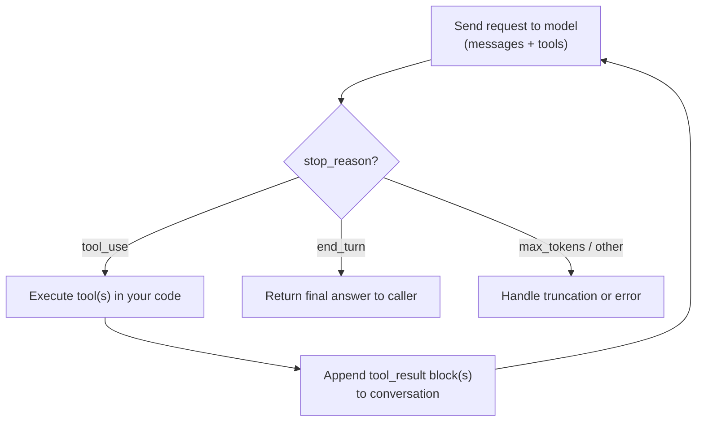
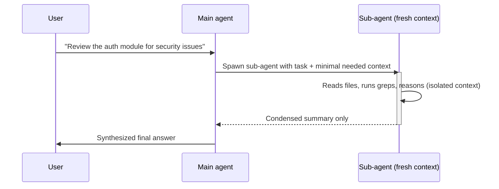
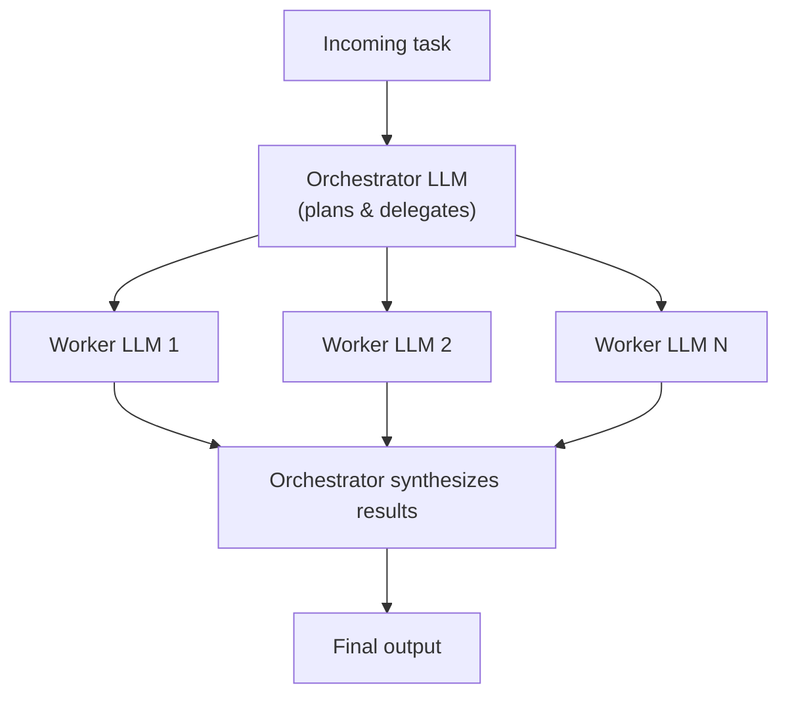

## Workflows vs. agents — the decision criteria

The canonical source for this whole domain is Anthropic's engineering post **["Building Effective Agents"](https://www.anthropic.com/engineering/building-effective-agents)**. Its central distinction shows up repeatedly on the exam.

- {{Workflow|A system where LLMs and tools are orchestrated through predefined code paths}} — **fixed control flow written by you**. The sequence of steps, branches, and tool calls is decided in advance, in code.
  - Predictable, consistent, easy to test and debug.
  - Right for well-defined tasks where the steps are known ahead of time.
- {{Agent|A system where the LLM dynamically directs its own process and tool usage, maintaining control over how it accomplishes a task}} — **model-directed control flow**. The LLM decides at runtime which tools to call, in what order, and when it's done.
  - More flexible and can handle open-ended, unpredictable tasks.
  - Costs more latency and tokens, and is harder to predict/debug than a workflow.
- **Decision rule:** if you can draw the flowchart in advance, build a workflow. If the number and order of steps genuinely depends on what the model discovers along the way, you need an agent.
- Anthropic's own advice is to **start simpler than either**: a single well-optimized LLM call (with good retrieval and in-context examples) often suffices. Only add workflow/agent complexity when a simple call demonstrably falls short.

> **Exam tip:** the blueprint phrase "predictable multi-step pipeline with fixed control flow = workflow; open-ended, model-directed control flow = agent" is close to a direct quote from the source post — expect a question that just asks you to classify a scenario as one or the other.

### The augmented LLM — the shared building block

- Both workflows and agents are built from the same primitive: an **augmented LLM** — a model enhanced with retrieval, tools, and memory.
- Modern Claude models can generate their own search queries, pick appropriate tools, and decide what to retain — this capability is what makes agents viable at all.
- Design principle either way: give the model a **clear, minimal interface** to its capabilities (well-documented tools, not a kitchen sink) rather than maximizing the number of things it *could* do.

> **Gotcha:** "agent" in casual conversation often just means "a chatbot that uses tools." On the exam, hold the stricter distinction — a single LLM call with tool access that always follows the same fixed sequence is still a *workflow*, not an agent, because the control flow is fixed rather than model-directed.

---

## The tool-use loop mechanics

Whether you're inside a workflow step or a fully autonomous agent, the mechanical unit underneath is the **tool-use loop**: the model asks for a tool, your code runs it, you hand the result back, repeat.

- The model emits a `stop_reason: "tool_use"` response containing one or more {{tool_use|A content block the model emits requesting a specific tool call, with a name, input, and a unique id}} blocks.
- **Your application code** — not the model — actually executes the tool (calls an API, runs a shell command, queries a database).
- You return the outcome as a `tool_result` content block, matched to the request via `tool_use_id`, inside a new `user` message.
- The full loop repeats — the model may call more tools, or it may finish with `stop_reason: "end_turn"`.
- **Multiple tool calls in one turn** are common (parallel tool use) — execute them concurrently and return *all* results together in a single message; splitting them across messages teaches the model to stop batching calls.
- Always append the model's **full** response content (not just the text) back into conversation history — dropping intermediate blocks (like thinking or tool_use blocks) breaks the next turn.

Concretely, one turn of the loop against the raw Messages API looks like this — this is the shape every implementation (SDK, `tool_runner`, hand-rolled) reduces to underneath:

```python
response = client.messages.create(
    model="claude-opus-5",
    max_tokens=1024,
    tools=tools,
    messages=messages,
)
messages.append({"role": "assistant", "content": response.content})

if response.stop_reason == "tool_use":
    tool_results = []
    for block in response.content:
        if block.type == "tool_use":
            result = execute_tool(block.name, block.input)  # YOUR code runs the tool, not the model
            tool_results.append({
                "type": "tool_result",
                "tool_use_id": block.id,  # matches this result back to its tool_use request
                "content": result,
            })
    messages.append({"role": "user", "content": tool_results})
    # send `messages` back to the model again — repeat until stop_reason != "tool_use"
```

> **In practice:** `execute_tool` is where real systems differ most — it's your dispatch function mapping a tool `name` to actual code (an API call, a DB query, a shell command). A common bug is forgetting to wrap it in a `try/except` so a failing tool crashes the loop instead of coming back as a `tool_result` with `is_error: true`.



- This loop is what the **Claude Agent SDK**, the **API's tool runner helper**, and any **hand-rolled loop** all implement underneath — they differ in who writes the loop and what's automated around it (see next section).

> **Exam tip:** the stopping condition for the loop is `stop_reason != "tool_use"` — usually `end_turn`. A loop that only checks "did the model call a tool" and never checks a max-iteration guard is a classic runaway-agent bug.

---

## The Claude Agent SDK vs. building your own loop

### What the Claude Agent SDK gives you out of the box

The **[Claude Agent SDK](https://code.claude.com/docs/en/agent-sdk/overview)** packages the same harness that powers Claude Code as a library — you get the agent loop *and* a batteries-included environment around it, not just raw API access. It's available for Python and TypeScript; these notes use Python.

- **Built-in tools** — file read/write/edit, bash execution, web search — ready to use with no implementation work.
- **The agent loop itself** — planning, calling tools, deciding when a task is done — is handled for you; you don't write the `while` loop.
- **Automatic context management** — the SDK compacts the conversation as it fills, so long-running tasks don't simply run out of context (see Memory & compaction below).
- **Permissions** — fine-grained control over which tools run automatically vs. require approval.
- **Sub-agents** — spawn specialized agents for focused subtasks (own section below).
- **MCP support** — connect external tools/data sources via the Model Context Protocol.
- **Sessions** — maintain context across exchanges; resume or fork a conversation later.
- **Skills, hooks, slash commands, plugins** — the same extensibility surface as Claude Code itself, loaded from `.claude/` directories.

### Installation

Requires **Python 3.10+**. Two ways to install the `claude-agent-sdk` package:

```bash
# uv (recommended) — handles the virtual environment for you
uv init
uv add claude-agent-sdk

# pip — create/activate a venv first
python3 -m venv .venv
source .venv/bin/activate          # Windows: .venv\Scripts\Activate.ps1
pip install claude-agent-sdk
```

Then set an API key in the shell you'll run the agent from — the SDK reads it from the process environment and does **not** load `.env` files automatically:

```bash
export ANTHROPIC_API_KEY=your-api-key    # Windows PowerShell: $env:ANTHROPIC_API_KEY = "your-api-key"
```

> **In practice:** you generally do **not** need Node.js or a separate Claude Code install — the Python (and TypeScript) SDK packages bundle a native Claude Code binary, which is what actually drives the agent loop under the hood. The exception is platforms where pip can't get a prebuilt wheel (e.g. ARM64 Windows), where no binary ships and you have to [install Claude Code natively](https://code.claude.com/docs/en/setup) yourself — the SDK then finds it on `PATH`.

```python
import asyncio
from claude_agent_sdk import query, ClaudeAgentOptions

async def main():
    async for message in query(
        prompt="Find and fix the bug in the auth module",
        options=ClaudeAgentOptions(allowed_tools=["Read", "Edit", "Bash", "Grep"]),
    ):
        if hasattr(message, "result"):
            print(message.result)

asyncio.run(main())
```

> **Note:** the Agent SDK is a distinct product from the plain Anthropic API's `tool_runner` helper. The `tool_runner` (`client.beta.messages.tool_runner`) automates the request→execute→loop cycle for *tools you define yourself* — no built-in file/bash tools, no context compaction, no sandbox. The Agent SDK is the full Claude Code harness with built-in tools included. Both still leave *deployment* (hosting, infra) to you.

> **In practice:** `query()` starts a **fresh session on every call** — it's built for one-off tasks. For a continuous multi-turn conversation that keeps its own state (as opposed to you re-supplying history), the SDK also exposes a `ClaudeSDKClient` class. Most option fields are snake_case (`allowed_tools`, `permission_mode`, `system_prompt`), but a few multi-word ones deliberately keep camelCase to match the underlying wire format — `disallowedTools`, `mcpServers` — worth noticing since it's an easy typo to make.

### Building a custom agent loop by hand

If you're not using the SDK — calling the raw Messages API and driving the loop yourself — you own everything the SDK would otherwise give you:

- **The loop control flow** — repeatedly call the API, inspect `stop_reason`, execute tools, append results, resend.
- **Stopping conditions** — not just `end_turn`, but a **max-iteration / max-turns cap** to prevent infinite loops (a model can get stuck re-calling a failing tool), and often a token or cost budget.
- **Error handling** — a failed tool call should come back as a `tool_result` with `is_error: true` so the model can adapt, not silently drop the turn or crash the process.
- **State/history management** — you must persist and correctly append the full conversation, including tool_use/tool_result pairing, across turns yourself.
- **Context management** — nothing compacts automatically; you decide when and how to summarize or prune (see next section).
- **Permissions/approval gates** — if a tool is destructive, you write the human-in-the-loop confirmation step.

```python
# Minimal custom agent loop (pseudocode)
messages = [{"role": "user", "content": user_input}]
MAX_ITERATIONS = 10

for i in range(MAX_ITERATIONS):
    response = client.messages.create(
        model="claude-opus-5", max_tokens=4096,
        tools=tools, messages=messages,
    )
    messages.append({"role": "assistant", "content": response.content})

    if response.stop_reason != "tool_use":
        break  # end_turn, or something else to handle explicitly

    tool_results = []
    for block in response.content:
        if block.type == "tool_use":
            try:
                result = execute_tool(block.name, block.input)
                tool_results.append({"type": "tool_result",
                                      "tool_use_id": block.id, "content": result})
            except Exception as e:
                tool_results.append({"type": "tool_result",
                                      "tool_use_id": block.id,
                                      "content": str(e), "is_error": True})
    messages.append({"role": "user", "content": tool_results})
else:
    raise RuntimeError("Agent did not finish within MAX_ITERATIONS")
```

> **Exam tip:** "what must you implement yourself if not using the SDK/tool runner?" → the loop, the stopping condition(s), error handling for failed tool calls, and context/state management. The SDK's main value-add over the raw loop is exactly these pieces being handled for you, plus built-in tools.

---

## Sub-agents

- A **sub-agent** is a separate agent instance the main agent spawns to handle a focused subtask, then returns a summary to the parent.
- **Why delegate to a sub-agent:**
  - **Context isolation** — the sub-agent runs in its own fresh context window. Intermediate tool calls and exploration (e.g. reading dozens of files) stay inside the sub-agent; only its *final* condensed message returns to the parent. This keeps the parent's context small.
  - **Parallelization** — independent sub-agents can run concurrently, so total time is bounded by the slowest one, not the sum of all of them.
  - **Specialization** — each sub-agent can carry its own system prompt with narrow expertise (e.g. a `database-migration` agent that knows rollback strategies the main agent doesn't need cluttering its own prompt).
  - **Tool restriction / least privilege** — a sub-agent can be limited to a safe subset of tools (e.g. `Read`, `Grep`, `Glob` only), reducing the blast radius of an unintended action.
- **What a sub-agent inherits:** its own system prompt plus the exact prompt/instructions the parent hands it. It does **not** inherit the parent's conversation history or tool results — anything it needs (file paths, prior decisions, error messages) must be passed explicitly in the delegation prompt.
- **What comes back:** only the sub-agent's final message returns to the parent as the tool result — not its full transcript. This is the mechanism that keeps parent context small.
- Sub-agents can be defined **programmatically** (in code, via an `AgentDefinition`-style object with `description`, `prompt`, `tools`, `model`) or **as filesystem-based markdown files** (e.g. `.claude/agents/*.md`). A built-in general-purpose sub-agent is also available without defining anything.
- The model decides *when* to invoke a sub-agent based on its `description` field — write descriptions that clearly state when to use it, the same way you'd write a good tool description.

### Real subagent file structure

A filesystem-based subagent for Claude Code is just a Markdown file with YAML {{frontmatter|the `---`-delimited metadata block at the top of a Markdown file}} living under `.claude/agents/` (project-scoped) or `~/.claude/agents/` (user-scoped, available in every project):

```
your-project/
└── .claude/
    └── agents/
        └── code-reviewer.md
```

The frontmatter is the configuration; the Markdown body below it becomes the subagent's **system prompt**:

```markdown
---
name: code-reviewer
description: Reviews code for quality and best practices. Use proactively after code is written or modified.
tools: Read, Glob, Grep
model: sonnet
---

You are a code reviewer. When invoked, analyze the code and provide
specific, actionable feedback on quality, security, and best practices.
```

Only `name` and `description` are required — everything else falls back to sensible defaults. The most commonly used fields:

| Field | Required | Meaning |
|---|---|---|
| `name` | Yes | Unique identifier, lowercase letters and hyphens |
| `description` | Yes | Tells the *main* Claude when to delegate to this subagent — write it the way you'd write a tool description |
| `tools` | No | Comma-separated allowlist (e.g. `Read, Grep, Glob`). Omit it to inherit every tool available to subagents |
| `disallowedTools` | No | Denylist instead of an allowlist — removes tools from the inherited/specified set |
| `model` | No | `sonnet`, `opus`, `haiku`, `fable`, a full model ID, or `inherit` (default) |
| `permissionMode` | No | `default`, `acceptEdits`, `auto`, `dontAsk`, `bypassPermissions`, or `plan` |

*A handful of more advanced fields exist beyond this table — `maxTurns`, `skills` (preload skill content), `mcpServers`, `hooks`, `memory` (persistent cross-session notes), `background`, `effort`, `isolation` (run in a git worktree), `color`, `initialPrompt` — worth knowing they exist, not worth memorizing for the exam.*

> **In practice:** Claude Code ships several **built-in** subagents you don't have to define — `Explore` (fast, read-only search), `Plan` (research during plan mode), and `general-purpose` (full tool access for multi-step work) — so a bare "spawn a subagent to look into X" often just works with zero setup. A project or user subagent with the same `name` as a built-in one overrides it.

> **In practice:** as of recent Claude Code versions, subagents run **in the background by default** and the interactive `/agents` creation wizard has been removed — the documented workflow is now "ask Claude to write the `.claude/agents/*.md` file for you" or edit it by hand, not a TUI form.

### Defining subagents programmatically (Agent SDK)

Inside the Agent SDK, pass an `agents` map to `ClaudeAgentOptions` instead of — or in addition to — filesystem files. Each entry is an `AgentDefinition` with the same conceptual fields as the frontmatter above (`description`, `prompt` — this is the body/system-prompt equivalent, `tools`, `model`, plus the advanced fields). Programmatic definitions take precedence over a filesystem agent with the same name.

```python
from claude_agent_sdk import query, ClaudeAgentOptions, AgentDefinition

options = ClaudeAgentOptions(
    # Agent must be allowed, since Claude invokes subagents through the Agent tool
    allowed_tools=["Read", "Grep", "Glob", "Agent"],
    agents={
        "code-reviewer": AgentDefinition(
            description="Expert code review specialist. Use for quality, security, and maintainability reviews.",
            prompt="You are a code review specialist. Identify security issues, "
                   "performance problems, and deviations from best practices.",
            tools=["Read", "Grep", "Glob"],
            model="sonnet",
        ),
    },
)
```

> **Gotcha:** forgetting to add `"Agent"` to `allowed_tools` is the most common reason a defined subagent never gets invoked — without it, the Agent tool call falls through to your permission callback (or is auto-denied in `dontAsk` mode) instead of running.



> **Exam tip:** the reason sub-agents scale better than one long agent conversation is **context isolation** — detailed exploration doesn't bloat the parent's window. This is the same idea Anthropic's context-engineering post calls "separation of concerns."

---

## Memory & context compaction

Long-running agents accumulate tool results, reasoning, and turns until they threaten to exceed the context window — and even before hitting the limit, a bloated context degrades response quality. Anthropic's engineering post **["Effective context engineering for AI agents"](https://www.anthropic.com/engineering/effective-context-engineering-for-ai-agents)** frames the core principle simply: at every step, find *the smallest set of high-signal tokens that maximizes the likelihood of the desired outcome*.

Three complementary techniques:

- **Compaction** — summarize a conversation nearing its context limit and reinitialize a new context window seeded with that summary.
  - Keep architectural decisions and unresolved issues; discard redundant tool output.
  - Start by maximizing recall (capture everything that might matter), then refine down.
  - Clearing old tool results is a lightweight first step before full summarization.
  - The Claude Agent SDK does this **automatically** as the window fills — you don't write summarization code yourself. The plain Messages API also offers this as a (beta) server-side feature.
- **Structured note-taking / external memory** — the agent writes persistent notes (e.g. a `NOTES.md` or to-do list) *outside* the context window and reads them back later.
  - Lets an agent track progress across a task that spans multiple context resets, without paying the token cost of keeping everything in-window.
- **Sub-agent architectures** — as above: push detailed exploration into a sub-agent with a clean context window, and only pull back a condensed (roughly 1,000–2,000 token) summary. This is itself a context-management strategy, not just a delegation one.

> **Gotcha:** compaction summarizes/replaces context; it is a distinct concept from **context editing**, which *clears* stale tool results or thinking blocks without summarizing them. Don't conflate the two if a question asks specifically which technique "discards" vs. "summarizes."

> **Exam tip:** if a question describes an agent that "runs for hours" or "exceeds the context window," the expected answer touches compaction, note-taking to external memory, and/or delegating to sub-agents with isolated context — not simply "use a bigger context window."

---

## Orchestration patterns

Anthropic's "Building Effective Agents" post names five recurring workflow/agent patterns. Know the shape of each and when it applies — this is dense exam material.

| Pattern | Structure | When to use |
|---|---|---|
| **Prompt chaining** | Sequential LLM calls; each step's output feeds the next; optional programmatic "gate" checks between steps | Task decomposes cleanly into fixed subtasks; trading latency for higher accuracy is acceptable |
| **Routing** | Classify the input first, then send it down one of several specialized downstream paths | Distinct input categories that are each handled better by a dedicated prompt/model |
| **Parallelization** | *Sectioning* — independent subtasks run simultaneously; or *Voting* — the same task run multiple times for diverse outputs | Speed (sectioning), or higher confidence via multiple independent perspectives (voting) |
| **Orchestrator-workers** | A central orchestrator LLM breaks a task down dynamically and delegates pieces to worker LLMs, then synthesizes their results | Subtasks can't be predetermined — the decomposition itself depends on what's discovered |
| **Evaluator-optimizer** | One LLM generates a response; a second LLM evaluates it and gives feedback; loop until the evaluator is satisfied | Clear evaluation criteria exist and iterative refinement measurably improves output |

- **Prompt chaining** example: generate marketing copy, then translate it; or draft an outline, then write from it.
- **Routing** example: send simple customer-service queries to a cheap/fast model, complex ones to a more capable model.
- **Parallelization** example: run guardrail screening and response generation simultaneously (sectioning); have several independent code reviewers flag vulnerabilities and combine findings (voting).
- **Orchestrator-workers** example: a multi-file coding change where the set of files to touch isn't known until the orchestrator investigates.
- **Evaluator-optimizer** example: iterative literary translation, refined against feedback each round.

**Routing sketch** — a cheap classification step decides which downstream path (system prompt, model, or even a different tool set) handles the request:

```python
# Illustrative — call_model()/classify() stand in for however you invoke
# Claude in your stack (client.messages.create, the Agent SDK's query(), etc.)
def route(user_query: str) -> str:
    category = classify(user_query)  # fast/cheap model call, or a keyword/regex heuristic

    if category == "billing":
        return call_model(system=BILLING_SYSTEM_PROMPT, prompt=user_query, model="claude-haiku-5")
    elif category == "technical":
        return call_model(system=TECH_SYSTEM_PROMPT, prompt=user_query, model="claude-sonnet-5")
    else:
        return call_model(system=GENERAL_SYSTEM_PROMPT, prompt=user_query, model="claude-opus-5")
```

**Orchestrator-workers sketch** — the orchestrator decides the breakdown at runtime, then fans work out and synthesizes the results:

```python
# Illustrative shape — in the Agent SDK this maps naturally onto AgentDefinition
# workers spawned via the `agents` option (see the Sub-agents section above).
async def orchestrator_workers(task: str) -> str:
    plan = await call_model_async(system=ORCHESTRATOR_PROMPT, prompt=task)  # e.g. "which files to touch"
    subtasks = parse_plan(plan)  # decomposition decided at runtime, not hardcoded

    worker_calls = [call_model_async(system=WORKER_PROMPT, prompt=st) for st in subtasks]
    worker_outputs = await asyncio.gather(*worker_calls)  # fan out, run concurrently

    return await call_model_async(
        system=SYNTHESIZER_PROMPT,
        prompt="\n\n".join(worker_outputs),
    )
```

> **In practice:** for a handful of workers, hand-rolled fan-out (or the SDK's `agents` option) is enough. For coordinating **dozens to hundreds** of agents, the Agent SDK exposes a `Workflow` tool that moves orchestration into a script the runtime executes outside the conversation's context window — turn-by-turn subagent delegation doesn't scale that far because every worker's result still has to pass back through the orchestrator's own context.



> **Exam tip:** orchestrator-workers is the pattern most often confused with routing — the distinguishing factor is that in routing, exactly **one** path is chosen up front and executed; in orchestrator-workers, the orchestrator dynamically decides the **decomposition itself** (potentially many workers, decided at runtime) and then combines their outputs. Also note orchestrator-workers is the closest workflow pattern to a true "agent" — the exam may test that it sits on the workflow→agent spectrum.

> **Gotcha:** all five patterns are *workflow* patterns (fixed code paths orchestrating LLM calls) in Anthropic's own framing — even orchestrator-workers, despite superficially resembling an agent, is still typically implemented with an orchestrator loop that has a bounded, code-defined structure rather than fully open-ended model control.

### Further reading

- [Building Effective Agents](https://www.anthropic.com/engineering/building-effective-agents) — the canonical source for workflows vs. agents and the five orchestration patterns
- [Effective context engineering for AI agents](https://www.anthropic.com/engineering/effective-context-engineering-for-ai-agents) — compaction, structured note-taking, and sub-agent strategies for long-running agents
- [Agent SDK overview](https://code.claude.com/docs/en/agent-sdk/overview) — what the Claude Agent SDK provides (built-in tools, context management, permissions, sessions, sub-agents)
- [Create custom subagents](https://code.claude.com/docs/en/sub-agents) — the full `.claude/agents/*.md` file format, all supported frontmatter fields, scopes, hooks, and memory
- [Subagents in the SDK](https://code.claude.com/docs/en/agent-sdk/subagents) — how to define subagents programmatically with `AgentDefinition`, invoke and restrict them, and the `Workflow` tool for large-scale fan-out
- [Tool use overview](https://platform.claude.com/docs/en/agents-and-tools/tool-use/overview) — the tool-use loop, tool definitions, and handling tool results
- [Compaction](https://platform.claude.com/docs/en/build-with-claude/compaction) — server-side automatic context compaction on the Messages API
