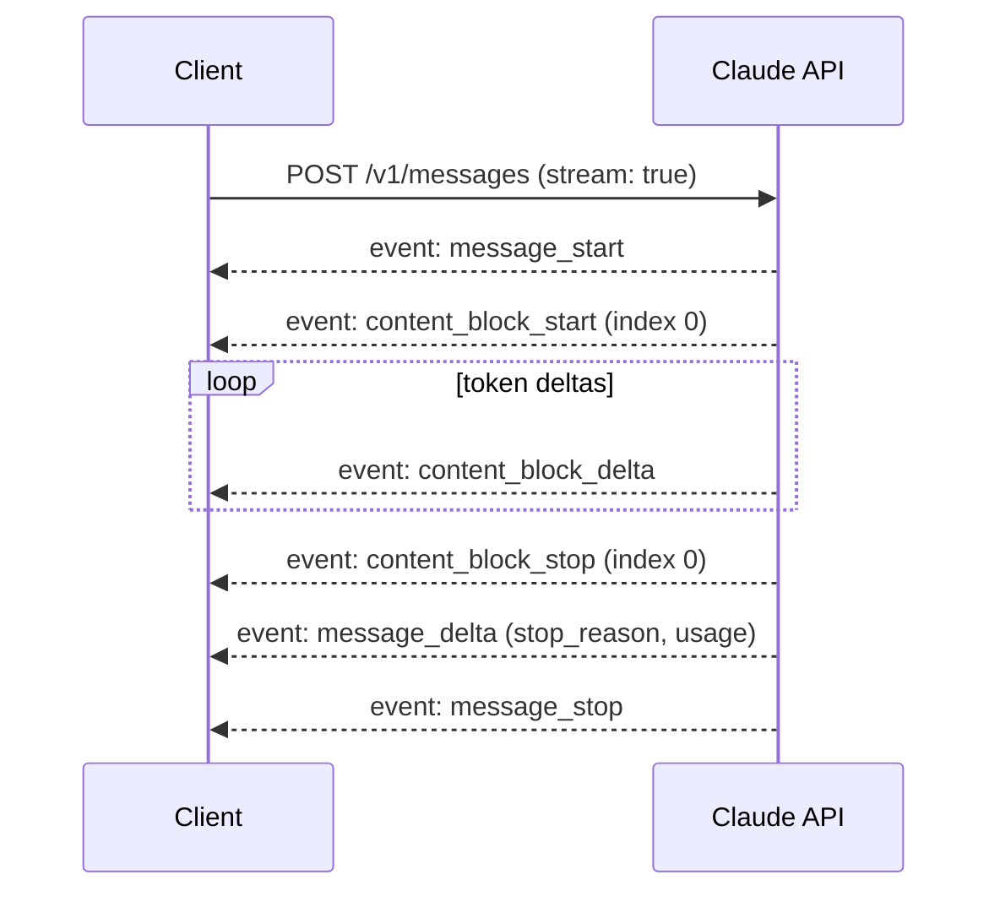
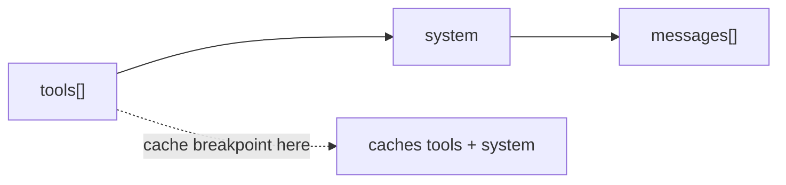
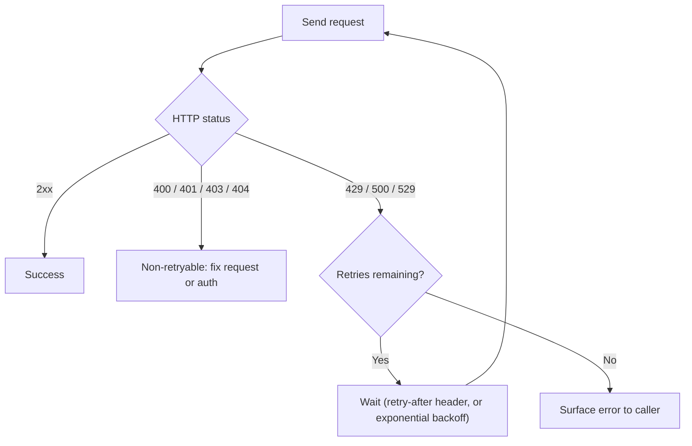

## Messages API core mechanics

Everything in the Claude API funnels through **one endpoint**: `POST /v1/messages`. There is no separate "chat" vs "completion" endpoint — tools, vision, caching, and streaming are all just parameters on this same call.

> **Exam tip:** If a question describes "the core Claude API endpoint," the answer is `POST /v1/messages`, not `/v1/completions` (that's the deprecated legacy Text Completions API).

- Required request fields:
  - `model` — the model id string, e.g. `claude-opus-5` (never guess/invent an id — exact strings matter).
  - `max_tokens` — a **hard ceiling** on generated output tokens (thinking + text, when thinking is on). It is *not* a target length, and it is not aware to the model unless you separately configure a task budget.
  - `messages` — an array of turns, each `{"role": ..., "content": ...}`.
- Common optional fields: `system` (the system prompt, a string or array of text blocks), `temperature`/`top_p`/`top_k` (sampling — **removed/rejected on several current models**, see the migration gotcha below), `stop_sequences`, `stream`, `tools`, `tool_choice`, `thinking`, `output_config` (effort + structured-output format).

### Roles and turn structure

- `` `role` `` is `"user"` or `"assistant"` for the normal back-and-forth. The API is **stateless** — every request resends the *entire* conversation history; Claude has no memory between calls unless you pass it back yourself.
- **Alternation rule:** the array must alternate `user` → `assistant` → `user` ...; the first message must be `role: "user"`. Sending two consecutive same-role messages or starting with `assistant` returns a `400 invalid_request_error`.
- `` `content` `` can be a plain string (shorthand for a single text block) or an **array of content blocks** — this is what lets one turn mix text, images, documents, tool results, etc.

```json
{
  "model": "claude-opus-5",
  "max_tokens": 1024,
  "system": "You are a concise technical assistant.",
  "messages": [
    { "role": "user", "content": "What's the capital of France?" },
    { "role": "assistant", "content": "Paris." },
    { "role": "user", "content": "And Germany?" }
  ]
}
```

### A real request, end to end

This is a verbatim, runnable `curl` call against the live endpoint (only the API key is a placeholder) and the response shape it returns:

```bash
curl https://api.anthropic.com/v1/messages \
  -H "content-type: application/json" \
  -H "anthropic-version: 2023-06-01" \
  -H "x-api-key: $ANTHROPIC_API_KEY" \
  -d '{
    "model": "claude-opus-5",
    "max_tokens": 1024,
    "messages": [
      { "role": "user", "content": "Hello, world" }
    ]
  }'
```

```json
{
  "id": "msg_013Zva2CMHLNnXjNJJKqJ2EF",
  "type": "message",
  "role": "assistant",
  "content": [
    { "type": "text", "text": "Hi! My name is Claude." }
  ],
  "model": "claude-opus-5",
  "stop_reason": "end_turn",
  "stop_sequence": null,
  "usage": {
    "input_tokens": 10,
    "output_tokens": 12,
    "cache_creation_input_tokens": 0,
    "cache_read_input_tokens": 0,
    "output_tokens_details": { "thinking_tokens": 0 },
    "server_tool_use": { "web_search_requests": 0, "web_fetch_requests": 0 },
    "service_tier": "standard"
  }
}
```

> **In practice:** production responses carry more `usage` fields than the exam-relevant `input_tokens`/`output_tokens`/cache pair — `output_tokens_details.thinking_tokens`, `server_tool_use` (per-server-tool call counts), `service_tier`, and (on models that support it) `inference_geo`. None of these are exam-critical, but if you're building cost dashboards, read them from `usage` directly rather than re-deriving them — they're already computed server-side.

### Content block types worth memorizing

| Block type | Appears in | Purpose |
|---|---|---|
| `text` | request & response | Plain text, optionally with `citations` |
| `image` | request | `source.type` is `base64`, `url`, or `file` (Files API) |
| `document` | request | PDFs/text docs; same three source types plus `text`/`content` |
| `thinking` / `redacted_thinking` | response (and echoed back in request) | Extended/adaptive reasoning output |
| `tool_use` | response | Claude requesting a tool call |
| `tool_result` | request | Your answer to a `tool_use` |
| `server_tool_use` / `*_tool_result` | response | Server-side tools (web search, code execution, etc.) |

### Response shape

- `id`, `type: "message"`, `role: "assistant"`, `model`, `content` (array of blocks), `stop_reason`, `stop_sequence`, `usage`.
- `` `stop_reason` `` — memorize this list, it is exam-favorite territory:

| `stop_reason` | Meaning |
|---|---|
| `end_turn` | Claude finished naturally |
| `max_tokens` | Hit the `max_tokens` cap — response may be truncated |
| `stop_sequence` | Hit a custom stop sequence |
| `tool_use` | Claude wants to call a tool — execute it and continue |
| `pause_turn` | A long server-side-tool turn paused; resend to resume |
| `refusal` | Safety classifiers declined — check `stop_details` |
| `model_context_window_exceeded` | Hit the **context window**, not the output cap |

> **Gotcha:** `max_tokens` truncation and `model_context_window_exceeded` are two *different* failure modes tested separately on the exam — one is "you asked for too little output," the other is "the whole conversation no longer fits."

- `` `usage` `` reports `input_tokens`, `output_tokens`, plus cache fields (see the caching section below).

### Multi-turn shape in practice

Every follow-up request must include the *full* prior exchange, including any `tool_use`/`tool_result` pairs and (unmodified) `thinking` blocks from the immediately preceding assistant turn. Dropping or editing a `thinking` block from the latest assistant turn before resending it is a `400`.

> **Note:** A top-level `system` parameter is the normal way to set a system prompt. Some current models also accept a `role: "system"` entry *inside* the `messages` array for injecting operator instructions mid-conversation without disturbing the cached prefix — this is a narrower, newer mechanism, not the default way to set instructions.

---

## Streaming responses

Set `` `"stream": true` `` on the request to receive the response incrementally over **{{SSE|Server-Sent Events: a one-directional HTTP streaming protocol built on a long-lived HTTP connection}}** instead of waiting for the full JSON body.

- **Why stream:**
  - Perceived latency — show tokens as they're generated instead of a blank screen.
  - Avoiding client/proxy HTTP timeouts on long generations — the SDKs *require* streaming once `max_tokens` gets large (roughly above ~16K on non-streaming calls) precisely to dodge this.
  - Building responsive chat UIs and progress indicators for agentic loops.

### Event flow



- **`message_start`** — a `Message` object with empty `content`; carries the initial (small) `usage`.
- **`content_block_start` / `content_block_delta` / `content_block_stop`** — one triplet per content block. Each block has an `index` matching its position in the final `content` array.
- **`content_block_delta`** carries a typed `delta`:
  - `text_delta` — `{ "text": "..." }` for plain text.
  - `input_json_delta` — `{ "partial_json": "..." }` for a `tool_use` block's `input`; accumulate the string fragments and parse once the block closes (the final value is always parseable JSON, the deltas are not).
  - `thinking_delta` / `signature_delta` — extended/adaptive thinking content, when `display: "summarized"` is set.
- **`message_delta`** — top-level changes (notably the final `stop_reason`) plus a **cumulative** `usage` update.
- **`message_stop`** — terminal event.
- **`ping`** — keep-alive, no payload significance; ignore it.
- **`error`** — can appear *mid-stream after an HTTP 200* (e.g. `overloaded_error`) — this bypasses normal HTTP-status error handling, so streaming clients need a separate error-event handler.

> **Exam tip:** The exam likes to test that `usage` in `message_delta` is **cumulative**, not a delta-of-tokens-this-event, and that streaming errors can arrive after a 200 status — both are easy to get wrong if you assume streaming behaves like a single failable HTTP call.

> **Gotcha:** Every SDK offers a way to just get the complete message back after consuming a stream internally (`stream.get_final_message()` in Python, `stream.finalMessage()` in TypeScript) — this is the recommended way to use streaming for large `max_tokens` when you don't actually need to render partial output. Don't hand-roll event accumulation unless you need per-token behavior.

```python
with client.messages.stream(
    model="claude-opus-5",
    max_tokens=64000,
    messages=[{"role": "user", "content": "Write a detailed report..."}],
) as stream:
    for text in stream.text_stream:
        print(text, end="", flush=True)
    final_message = stream.get_final_message()
```

### The raw SSE wire format

`text_stream` and `finalMessage()` hide the wire format on purpose. If you're debugging a streaming client, integrating from a language without an SDK, or just want to see what actually crosses the socket, this is the literal byte sequence the API sends for `{"model": "claude-opus-5", "max_tokens": 256, "messages": [{"role": "user", "content": "Hello"}], "stream": true}`:

```
event: message_start
data: {"type": "message_start", "message": {"id": "msg_1nZdL29xx5MUA1yADyHTEsnR8uuvGzszyY", "type": "message", "role": "assistant", "content": [], "model": "claude-opus-5", "stop_reason": null, "stop_sequence": null, "usage": {"input_tokens": 25, "output_tokens": 1}}}

event: content_block_start
data: {"type": "content_block_start", "index": 0, "content_block": {"type": "text", "text": ""}}

event: ping
data: {"type": "ping"}

event: content_block_delta
data: {"type": "content_block_delta", "index": 0, "delta": {"type": "text_delta", "text": "Hello"}}

event: content_block_delta
data: {"type": "content_block_delta", "index": 0, "delta": {"type": "text_delta", "text": "!"}}

event: content_block_stop
data: {"type": "content_block_stop", "index": 0}

event: message_delta
data: {"type": "message_delta", "delta": {"stop_reason": "end_turn", "stop_sequence": null}, "usage": {"output_tokens": 15}}

event: message_stop
data: {"type": "message_stop"}
```

*(IDs and token counts above are illustrative example values from the official docs, not something you should hardcode — treat the shape as real, the numbers as placeholders.)*

> **In practice:** notice each `event:` line is immediately followed by a `data:` line carrying a JSON payload whose own `"type"` field *duplicates* the SSE event name. Parse on the JSON `type` field, not the SSE `event:` line — some HTTP client libraries (older `fetch` polyfills, some Java SSE clients) don't expose named SSE events cleanly, but every one of them gives you the raw `data:` body.

### Handling the stream manually — a real event loop

When you need per-token control (e.g. rendering thinking and text differently, or accumulating a tool call's `partial_json`), iterate the stream's events directly instead of using the `text_stream` shortcut:

```python
import anthropic

client = anthropic.Anthropic()

with client.messages.stream(
    model="claude-opus-5",
    max_tokens=1024,
    tools=[{
        "name": "get_weather",
        "description": "Get the current weather in a given location",
        "input_schema": {
            "type": "object",
            "properties": {"location": {"type": "string"}},
            "required": ["location"],
        },
    }],
    messages=[{"role": "user", "content": "What's the weather in San Francisco?"}],
) as stream:
    for event in stream:
        if event.type == "content_block_start":
            print(f"\n--- block {event.index} started ({event.content_block.type}) ---")
        elif event.type == "content_block_delta":
            if event.delta.type == "text_delta":
                print(event.delta.text, end="", flush=True)
            elif event.delta.type == "input_json_delta":
                # partial_json fragments are NOT individually valid JSON —
                # accumulate them and parse only once content_block_stop fires.
                print(event.delta.partial_json, end="", flush=True)
        elif event.type == "content_block_stop":
            print(f"\n--- block {event.index} finished ---")
        elif event.type == "message_delta":
            print(f"\nstop_reason={event.delta.stop_reason}  usage={event.usage}")

    final_message = stream.get_final_message()
```

```typescript
const stream = client.messages.stream({
  model: "claude-opus-5",
  max_tokens: 1024,
  messages: [{ role: "user", content: "What's the weather in San Francisco?" }],
});

for await (const event of stream) {
  if (event.type === "content_block_delta") {
    if (event.delta.type === "text_delta") {
      process.stdout.write(event.delta.text);
    } else if (event.delta.type === "input_json_delta") {
      process.stdout.write(event.delta.partial_json);
    }
  } else if (event.type === "message_delta") {
    console.log(`\nstop_reason=${event.delta.stop_reason}`);
  }
}

const finalMessage = await stream.finalMessage();
```

---

## Vision & multimodal input

### Images

- Provide images as `image` content blocks with a `source`:
  - `` `{"type": "base64", "media_type": "image/png", "data": "..."}` `` — inline bytes.
  - `` `{"type": "url", "url": "https://..."}` `` — hosted reference (not available on Amazon Bedrock/Vertex — base64 only there).
  - `` `{"type": "file", "file_id": "..."}` `` — a file previously uploaded via the **Files API**.
- Supported formats: **JPEG, PNG, GIF, WebP**. Animated images are not supported — only the first frame is read.
- Request limits (may change — verify against current docs): up to **100 images per request** on 200k-context models, **600** on others; max **8000×8000 px** per image; max **10 MB** base64-encoded per image on the direct API (5 MB on Bedrock/Vertex).
- Image-then-text ordering performs slightly better than text-then-image, same principle as putting long documents before your question in text prompts.

**Token cost is resolution-based**, not file-size-based. Claude tiles images into 28×28-pixel patches ("visual tokens"):

$$
\text{visual tokens} = \left\lceil \frac{\text{width}}{28} \right\rceil \times \left\lceil \frac{\text{height}}{28} \right\rceil
$$

- Two resolution tiers gate the max size before downscaling kicks in: a **standard tier** (older models, long-edge cap ~1568px, ~1568 max visual tokens) and a **high-resolution tier** (newer models, long-edge cap ~2576px, ~4784 max visual tokens). Oversized images are downscaled to fit, preserving aspect ratio — you're never billed for more than the tier cap.

> **Gotcha:** A common exam trap is assuming smaller *file size* means cheaper request — it's **pixel dimensions** that drive token cost, not JPEG compression level. A heavily-compressed but high-resolution image can still cost far more tokens than a small, uncompressed one.

```python
import base64

with open("chart.png", "rb") as f:
    image_data = base64.standard_b64encode(f.read()).decode("utf-8")

message = client.messages.create(
    model="claude-opus-5",
    max_tokens=1024,
    messages=[{
        "role": "user",
        "content": [
            {
                "type": "image",
                "source": {"type": "base64", "media_type": "image/png", "data": image_data},
            },
            {"type": "text", "text": "What's in this image?"},
        ],
    }],
)
```

> **In practice:** base64-encoding a file always goes through a bytes-in-memory step (`base64.standard_b64encode(f.read())` in Python, `Buffer.from(fs.readFileSync(...)).toString("base64")` in Node). For anything over a few MB, prefer streaming the file into the Files API instead of holding the whole base64 string in memory — see the Files API section below.

### PDFs and documents

- PDFs use the `document` content block, same three source types as images (`base64`, `url`, `file`) plus `text` and `content` for pre-extracted text.
- Claude reads **both the text and the visual layout** of a PDF (charts, tables, scanned pages) — it's not a pure text-extraction pipeline.
- Limits (verify against current docs — these shift over time): request payload up to **32 MB**; up to **600 pages** per request (dropping to **100 pages** when the effective context window is under 1M tokens).

```json
{
  "type": "document",
  "source": { "type": "base64", "media_type": "application/pdf", "data": "<base64>" },
  "citations": { "enabled": true }
}
```

### Files API — base64 vs. file references

- Base64-embedding is simplest for one-off requests, but in **multi-turn conversations the full bytes get resent on every turn** since the API is stateless — this bloats payloads and latency as history grows.
- The **Files API** (`POST /v1/files`, beta header `` `files-api-2025-04-14` ``) uploads once and returns a `file_id` you reference repeatedly via `{"type": "file", "file_id": "..."}` — the bytes are stored server-side and never re-transmitted.
- Files are workspace-scoped (any API key in that workspace can read them) and, per current docs, capped around **500 MB per file** / **500 GB per organization** — treat these as illustrative, not load-bearing, numbers.
- Endpoints: `POST /v1/files` (upload), `GET /v1/files` (list), `GET /v1/files/{id}` (metadata), `GET /v1/files/{id}/content` (download — only for files *generated* by skills/code execution, not ones you uploaded), `DELETE /v1/files/{id}`.

```python
uploaded = client.beta.files.upload(
    file=open("report.pdf", "rb"),
    betas=["files-api-2025-04-14"],
)

response = client.beta.messages.create(
    model="claude-opus-5",
    max_tokens=1024,
    betas=["files-api-2025-04-14"],
    messages=[{
        "role": "user",
        "content": [
            {"type": "document", "source": {"type": "file", "file_id": uploaded.id}},
            {"type": "text", "text": "Summarize the key findings."},
        ],
    }],
)
```

> **Exam tip:** Know the tradeoff, not just the mechanism — base64 is simpler and needs no extra endpoint, but the Files API is the right call for images/PDFs reused across many requests or accumulating in long conversation history.

---

## Prompt caching mechanics

Prompt caching lets you avoid re-processing (and re-paying full price for) the parts of a prompt that don't change between requests — a large system prompt, a big retrieved document, a fixed tool list.

> **Note:** This section is the API-mechanics view. Cost/latency tradeoffs and cache-strategy design live in a sister notes file — here the focus is exact field names and how the mechanism works.

- **The core invariant: caching is a {{prefix cache|keyed to the exact byte sequence of the rendered prompt up to a marked point — any change anywhere in that prefix invalidates everything after it}}.** A single changed character invalidates every cache breakpoint positioned after it.
- **Render order** is fixed: `tools` → `system` → `messages`. A breakpoint on the last system block caches tools + system together.
- Mark a cache boundary with `` `cache_control` `` on a content block:

```json
{
  "type": "text",
  "text": "<large, stable system prompt>",
  "cache_control": { "type": "ephemeral" }
}
```

- `` `cache_control` `` can also carry an explicit TTL: `` `{"type": "ephemeral", "ttl": "5m"}` `` (default) or `` `"1h"` ``.
- Up to **4 cache breakpoints** per request.
- There is a **minimum cacheable prefix length** — shorter prompts silently don't cache (no error, just zero cache tokens). The exact minimum is model-dependent — as low as 512 tokens on the newest models, up to 4096 tokens on some older models — don't memorize a single number, know that a minimum exists and varies by model.

### A real multi-breakpoint request

A request combining a cached tool list, a cached system prompt, and a fresh per-request question — this is the shape you'll actually write in a RAG or agent harness with a stable tool surface:

```json
{
  "model": "claude-opus-5",
  "max_tokens": 1024,
  "tools": [
    {
      "name": "search_docs",
      "description": "Search internal documentation",
      "input_schema": { "type": "object", "properties": { "query": { "type": "string" } }, "required": ["query"] },
      "cache_control": { "type": "ephemeral" }
    }
  ],
  "system": [
    {
      "type": "text",
      "text": "You are an AI assistant tasked with analyzing literary works. Cite sources for every claim.",
      "cache_control": { "type": "ephemeral", "ttl": "1h" }
    }
  ],
  "messages": [
    { "role": "user", "content": "Analyze the major themes in Pride and Prejudice." }
  ]
}
```

Because `cache_control` on the **last** tool definition caches everything at or before it (tools render first), and the system block carries its own breakpoint, this request writes two cache entries in one call — a common pattern when your tool list is stable but larger/more expensive to re-process than your system prompt.

### Cache read vs. write, and how to verify it

- `` `usage.cache_creation_input_tokens` `` — tokens **written** to the cache this request.
- `` `usage.cache_read_input_tokens` `` — tokens **served from** the cache this request.
- `` `usage.input_tokens` `` — the uncached remainder only. Total prompt size = the sum of all three fields.
- If `cache_read_input_tokens` stays at zero across repeated, supposedly-identical requests, something in the prefix is silently changing (a timestamp, a non-deterministically-serialized JSON object, a varying tool set) — that's a standard debugging scenario the exam may pose.

> **Gotcha:** Adding, removing, or reordering **tools**, or switching the **model**, invalidates the cache — both render at/near the very front of the prompt. Toggling `tool_choice` or `thinking` on/off, by contrast, only invalidates the *messages* tier, not tools/system — the API has a tiered invalidation hierarchy, not one all-or-nothing cache.



> **In practice:** the single most common cause of a silently-zero `cache_read_input_tokens` in real codebases is `datetime.now()` (or an equivalent "current date/time" string) interpolated into the system prompt, or a Python `dict`/JS object whose key order isn't stable across requests (`json.dumps(d)` without `sort_keys=True`). Diff the exact bytes of two consecutive request bodies before assuming the caching feature itself is broken — it almost never is.

---

## Tool use at the API level

> **Note:** Tool *design* (schemas, choosing what to expose, agent loop patterns) is covered in depth in a sister "Tools & MCPs" file. This section is strictly how `tool_use`/`tool_result` blocks flow through `POST /v1/messages`.

- Declare tools in the top-level `` `tools` `` array — each has `name`, `description`, and a JSON Schema `` `input_schema` ``.
- `` `tool_choice` `` controls whether/which tool gets used: `` `{"type": "auto"}` `` (default — Claude decides), `` `{"type": "any"}` `` (must use *some* tool), `` `{"type": "tool", "name": "..."}` `` (must use this specific tool), `` `{"type": "none"}` ``.
- When Claude wants to call a tool, the response's `content` includes a `` `tool_use` `` block: `{"type": "tool_use", "id": "toolu_...", "name": "...", "input": {...}}`, and `` `stop_reason` `` is `"tool_use"`.
- Your application executes the tool, then sends the result back as a `` `tool_result` `` block **inside a new `user` message**:

```json
{
  "role": "user",
  "content": [
    { "type": "tool_result", "tool_use_id": "toolu_01A...", "content": "72°F and sunny", "is_error": false }
  ]
}
```

- **Parallel tool calls:** one assistant turn can contain multiple `tool_use` blocks. Execute them concurrently and return **all** the matching `tool_result` blocks in a **single** subsequent user message — splitting them across multiple messages is a common mistake that silently discourages future parallel calls.
- Failed tool executions still get a `tool_result` — just set `` `"is_error": true` `` rather than omitting the block.

> **Exam tip:** The request/response round trip for tool use is: assistant turn with `tool_use` → you execute → user turn with `tool_result` → repeat until `stop_reason` is `end_turn`. This loop, not the tool schema itself, is what the exam tends to probe for the "Applications & Integration" angle (schema design is the Tools & MCPs domain).

> **In practice:** always parse `tool_use.input` with `json.loads()` / `JSON.parse()` rather than treating it as a pre-validated object, and never raw-string-match against the serialized JSON of a streamed `input_json_delta` — some models escape Unicode or forward slashes differently across versions, and only the final accumulated+parsed value is guaranteed stable.

---

## Official SDKs

Anthropic maintains official SDKs that wrap `POST /v1/messages` (and the other endpoints) with typed methods, streaming helpers, automatic retries, and typed exceptions.

| Language | Package | Install |
|---|---|---|
| Python | `anthropic` | `pip install anthropic` |
| TypeScript / JavaScript | `@anthropic-ai/sdk` | `npm install @anthropic-ai/sdk` |
| Java | `com.anthropic:anthropic-java` | Maven/Gradle |
| Go | `github.com/anthropics/anthropic-sdk-go` | `go get` |
| Ruby | `anthropic` gem | `gem install anthropic` |
| C# | `Anthropic` (NuGet) | `dotnet add package Anthropic` |
| PHP | `anthropic-ai/sdk` | `composer require` |

```bash
# Python — inside a virtualenv/venv, not globally
pip install anthropic

# TypeScript/JavaScript
npm install @anthropic-ai/sdk
```

### Python

```python
import os
from anthropic import Anthropic

client = Anthropic(
    api_key=os.environ.get("ANTHROPIC_API_KEY"),  # default; can be omitted
)

message = client.messages.create(
    model="claude-opus-5",
    max_tokens=1024,
    messages=[{"role": "user", "content": "Hello, Claude"}],
)
print(message.content)
```

### TypeScript

```typescript
import Anthropic from "@anthropic-ai/sdk";

const client = new Anthropic({
  apiKey: process.env["ANTHROPIC_API_KEY"], // default; can be omitted
});

const message = await client.messages.create({
  model: "claude-opus-5",
  max_tokens: 1024,
  messages: [{ role: "user", content: "Hello, Claude" }],
});

console.log(message.content);
```

> **Exam tip:** The client constructor reads `` `ANTHROPIC_API_KEY` `` from the environment by default — the exam may test that you *don't* need to pass `apiKey`/`api_key` explicitly if that env var is set, and that hardcoding a key in source is the wrong pattern (see architecture section below).

> **Gotcha:** "SDK" vs. "raw HTTP" is a real design decision, not just style — the SDKs add typed exceptions, automatic retry-with-backoff, streaming accumulation helpers, and request-size/timeout handling you'd otherwise reimplement. Default to the official SDK unless the project is explicitly a shell/cURL integration or has no SDK for its language.

> **In practice:** `message.content` is an *array* of content blocks, never a bare string — even a plain-text reply comes back as `[{"type": "text", "text": "..."}]`. New Python/TypeScript code should narrow by `block.type` before reading `.text` (`if block.type == "text": print(block.text)`), both because a `tool_use`-only turn has no text block at all, and because a well-typed language (TypeScript especially) will refuse to compile `content[0].text` against a discriminated union without the narrowing check first.

---

## Auth, error handling & retries

### Authentication

- Standard auth: the `` `x-api-key` `` header carries your API key, alongside `` `anthropic-version: 2023-06-01` `` (a required API-version header — not optional).
- OAuth-style short-lived tokens (from CLI login flows, etc.) use `` `Authorization: Bearer <token>` `` **plus** an `` `anthropic-beta: oauth-2025-04-20` `` header — this is a different header pair from the API-key path, not just a drop-in swap.

```bash
curl https://api.anthropic.com/v1/messages \
  -H "x-api-key: $ANTHROPIC_API_KEY" \
  -H "anthropic-version: 2023-06-01" \
  -H "content-type: application/json" \
  -d '{"model": "claude-opus-5", "max_tokens": 1024, "messages": [{"role": "user", "content": "Hello"}]}'
```

### Passing auth in a real app — env var vs. explicit key

> **In practice:** almost every production integration should go through the SDK's default env-var resolution (`Anthropic()` / `new Anthropic()` with no arguments), not `Anthropic(api_key="sk-ant-...")` hardcoded or interpolated. Explicit `api_key=` is for the narrow case where a single process must talk to the API as *different* keys — e.g. a multi-tenant backend that holds one Anthropic key per customer and looks it up per request:

```python
# Default path — reads ANTHROPIC_API_KEY from the environment. Use this almost always.
client = Anthropic()

# Explicit key — only when the key genuinely varies at runtime (e.g. per-tenant).
# Never build this string from string concatenation with a hardcoded prefix + suffix.
tenant_key = secrets_manager.get_secret(f"anthropic-key-{tenant_id}")
client = Anthropic(api_key=tenant_key)
```

A typical local `.env` file (never committed — see the config-structure section below):

```
ANTHROPIC_API_KEY=sk-ant-api03-...
ANTHROPIC_LOG=warn
```

### HTTP status codes

| Code | `error.type` | Retryable? | Typical cause |
|---|---|---|---|
| 400 | `invalid_request_error` | No | Malformed request, bad params, non-alternating roles |
| 401 | `authentication_error` | No | Missing/invalid/expired API key |
| 402 | `billing_error` | No | Billing/payment issue on the account |
| 403 | `permission_error` | No | Key lacks access to the resource/model |
| 404 | `not_found_error` | No | Bad endpoint path or model id |
| 409 | `conflict_error` | Situational | Resource modified concurrently / uniqueness conflict |
| 413 | `request_too_large` | No | Payload over the endpoint's size limit |
| 429 | `rate_limit_error` | **Yes** | RPM/ITPM/OTPM exceeded |
| 500 | `api_error` | **Yes** | Anthropic-side issue |
| 504 | `timeout_error` | Situational | Request timed out server-side — consider streaming |
| 529 | `overloaded_error` | **Yes** | Temporary capacity overload |

> **Exam tip:** Request size caps differ **per endpoint**, not one global number — roughly Messages API 32 MB, Batch API 256 MB, Files API 500 MB (verify current figures against the docs; these limits do get revised).

- Every error response is JSON with a top-level `` `error: {type, message}` `` object and a `` `request_id` `` — include the `request_id` when filing a support ticket.
- Every response (success or error) carries a `` `request-id` `` header too, for correlating logs even when you didn't capture the body.

### Catching typed exceptions (not string-matching)

```python
import anthropic

client = anthropic.Anthropic()

try:
    message = client.messages.create(
        model="claude-opus-5",
        max_tokens=1024,
        messages=[{"role": "user", "content": "Hello"}],
    )
except anthropic.NotFoundError as e:        # 404 — e.g. bad model id
    ...
except anthropic.RateLimitError as e:       # 429 — back off and retry
    ...
except anthropic.APIStatusError as e:       # any other non-2xx HTTP response
    print(e.status_code, e.message)
except anthropic.APIConnectionError as e:   # network failure before a response
    ...
```

Order matters: catch the most specific exception classes first, then broader ones (`APIStatusError`, `APIConnectionError`) as a fallback. Each maps to one HTTP status — `BadRequestError` (400), `AuthenticationError` (401), `PermissionDeniedError` (403), `NotFoundError` (404), `RateLimitError` (429), `InternalServerError` (≥500).

### Retry-with-backoff



- The official SDKs **retry automatically** on connection errors, 429, and 5xx-class responses, using exponential backoff, **twice by default** (`max_retries`, configurable per-client or per-request).
- When present, honor the `` `retry-after` `` header (seconds to wait) rather than a fixed backoff schedule — it reflects server-side knowledge your client doesn't have.
- Rate-limit response headers to know: `` `anthropic-ratelimit-requests-limit/remaining/reset` ``, `` `anthropic-ratelimit-input-tokens-limit/remaining/reset` ``, `` `anthropic-ratelimit-output-tokens-limit/remaining/reset` `` (RFC 3339 timestamps for `reset`).
- Rate limits are enforced per **RPM** (requests/minute), **ITPM** (input tokens/minute), and **OTPM** (output tokens/minute), tracked **per model** — different models draw from separate pools.

> **Gotcha:** `max_tokens` does **not** factor into OTPM limit calculations — OTPM is metered on tokens actually produced, so setting a generous `max_tokens` "just in case" has no rate-limit downside (though it does affect your hard truncation ceiling and, on some models, thinking budget).

The SDK's built-in `max_retries` covers the common case. Here's what it's doing under the hood — useful to know when you need custom behavior (e.g. a circuit breaker, or per-tenant retry budgets a shared client can't express):

```python
import time
import random
import anthropic

client = anthropic.Anthropic(max_retries=0)  # disable the SDK's own retries; we're rolling our own

def create_with_backoff(max_attempts: int = 5, **kwargs):
    for attempt in range(max_attempts):
        try:
            return client.messages.create(**kwargs)
        except anthropic.RateLimitError as e:
            if attempt == max_attempts - 1:
                raise
            retry_after = e.response.headers.get("retry-after")
            delay = float(retry_after) if retry_after else (2 ** attempt) + random.uniform(0, 1)
            time.sleep(delay)
        except (anthropic.InternalServerError, anthropic.APIConnectionError):
            if attempt == max_attempts - 1:
                raise
            time.sleep((2 ** attempt) + random.uniform(0, 1))  # jittered exponential backoff

message = create_with_backoff(
    model="claude-opus-5",
    max_tokens=1024,
    messages=[{"role": "user", "content": "Hello"}],
)
```

> **In practice:** don't reach for this unless you have a concrete reason to override the SDK default — most teams should just tune `max_retries` (`Anthropic(max_retries=5)`) and move on. The snippet above exists to show *what* the default retry logic is actually doing (typed-exception branching + `retry-after` header + jittered exponential fallback), since "the SDK retries for you" can otherwise feel like a black box.

### Idempotency

> **Gotcha:** Unlike some REST/payment APIs, the Messages API has **no built-in idempotency-key parameter** for `POST /v1/messages`. A retried request after a dropped connection may generate and bill a *new* completion rather than returning the original one — this is a real operational consideration for retry logic, and a plausible exam distractor (don't assume every API in this domain works like Stripe's idempotency keys). The Batch API sidesteps this differently: you supply your own `` `custom_id` `` per sub-request so you can safely de-duplicate results by key.

---

## Batch API vs real-time processing

| | Messages API (real-time) | Message Batches API |
|---|---|---|
| Endpoint | `POST /v1/messages` | `POST /v1/messages/batches` |
| Latency | Seconds (or streamed) | Async — most complete in under an hour, up to ~24h |
| Cost | Standard pricing | **~50% discount** on token usage |
| Result ordering | N/A — one response per call | **Arbitrary** — key results by `custom_id`, never by position |
| Use when | User is waiting; interactive UX | Large volumes, no immediate-response requirement |

- Create a batch by submitting an array of sub-requests, each wrapped with your own `` `custom_id` `` (1–64 chars, `` `^[a-zA-Z0-9_-]{1,64}$` ``) and normal `params` (model, max_tokens, messages, etc.) — effectively many independent Messages API calls bundled together.
- Poll `` `GET /v1/messages/batches/{id}` `` until `` `processing_status` `` is `` `"ended"` ``, then stream results via the batch's `` `results_url` ``.
- Each result carries `` `custom_id` `` plus `` `result.type` `` — `` `"succeeded"` ``, `` `"errored"` ``, `` `"canceled"` ``, or `` `"expired"` ``. On success, read `` `result.message.content` `` exactly as you would a normal Messages response.
- Batch sub-requests support essentially the full Messages API surface — vision, tools, caching, structured outputs. A handful of parameters are rejected as validation errors inside a batch: `stream: true` (results come back as a file, not a live stream), `speed` (fast mode only applies to synchronous latency), and `max_tokens: 0` (cache pre-warming — an ephemeral cache entry would likely expire before the batch worker gets to it).

> **Exam tip:** The exam's classic "which should you use" framing: **real-time** for anything a human is waiting on (chat, live agent turns); **batch** for bulk, latency-insensitive workloads — content moderation sweeps, large-scale evals, offline classification/extraction over a dataset. The 50% discount and async, poll-based lifecycle are the two facts most likely to be tested directly.

> **Gotcha:** Batch results can arrive in **any order** relative to submission — code that assumes result N corresponds to submitted request N will silently mismatch. Always index by `custom_id`.

### Creating a batch (real request)

```bash
curl https://api.anthropic.com/v1/messages/batches \
  -H "x-api-key: $ANTHROPIC_API_KEY" \
  -H "anthropic-version: 2023-06-01" \
  -H "content-type: application/json" \
  -d '{
    "requests": [
      {
        "custom_id": "my-first-request",
        "params": {
          "model": "claude-opus-5",
          "max_tokens": 1024,
          "messages": [{"role": "user", "content": "Hello, world"}]
        }
      },
      {
        "custom_id": "my-second-request",
        "params": {
          "model": "claude-opus-5",
          "max_tokens": 1024,
          "messages": [{"role": "user", "content": "Hi again, friend"}]
        }
      }
    ]
  }'
```

The immediate response, before any request has finished:

```json
{
  "id": "msgbatch_01HkcTjaV5uDC8jWR4ZsDV8d",
  "type": "message_batch",
  "processing_status": "in_progress",
  "request_counts": { "processing": 2, "succeeded": 0, "errored": 0, "canceled": 0, "expired": 0 },
  "ended_at": null,
  "created_at": "2026-08-10T18:37:24.100435Z",
  "expires_at": "2026-08-11T18:37:24.100435Z",
  "cancel_initiated_at": null,
  "results_url": null
}
```

### Polling and reading results (real code)

```python
import time
import anthropic

client = anthropic.Anthropic()

MESSAGE_BATCH_ID = "msgbatch_01HkcTjaV5uDC8jWR4ZsDV8d"

# 1. Poll until processing has ended
message_batch = None
while True:
    message_batch = client.messages.batches.retrieve(MESSAGE_BATCH_ID)
    if message_batch.processing_status == "ended":
        break
    print(f"Batch {MESSAGE_BATCH_ID} is still processing...")
    time.sleep(60)

# 2. Stream results — memory-efficient, one line at a time
for result in client.messages.batches.results(MESSAGE_BATCH_ID):
    match result.result.type:
        case "succeeded":
            print(f"Success! {result.custom_id}")
        case "errored":
            if result.result.error.error.type == "invalid_request_error":
                print(f"Validation error {result.custom_id} — fix the request, don't retry as-is")
            else:
                print(f"Server error {result.custom_id} — safe to retry")
        case "expired":
            print(f"Request expired {result.custom_id} — resubmit")
```

### A real `.jsonl` results line

`results_url` points at a **JSONL** file — one line per sub-request, each a standalone JSON object. This is the actual shape (two lines, note the second request's result arrives first — batch ordering is not submission order):

```json
{"custom_id":"my-second-request","result":{"type":"succeeded","message":{"id":"msg_014VwiXbi91y3JMjcpyGBHX5","type":"message","role":"assistant","model":"claude-opus-5","content":[{"type":"text","text":"Hello again! It's nice to see you. How can I assist you today?"}],"stop_reason":"end_turn","stop_sequence":null,"usage":{"input_tokens":11,"output_tokens":36}}}}
{"custom_id":"my-first-request","result":{"type":"succeeded","message":{"id":"msg_01FqfsLoHwgeFbguDgpz48m7","type":"message","role":"assistant","model":"claude-opus-5","content":[{"type":"text","text":"Hello! How can I assist you today?"}],"stop_reason":"end_turn","stop_sequence":null,"usage":{"input_tokens":10,"output_tokens":34}}}}
```

> **In practice:** because each line is independently valid JSON, you can process the results file with any line-oriented JSON tool — `jq -c '.' results.jsonl`, a Python generator reading line-by-line, or the SDK's `client.messages.batches.results(id)` iterator shown above, which streams the file rather than loading it all into memory. For a 100,000-request batch that matters — don't `json.load()` the whole thing.

> **Exam tip:** `errored` and `canceled` and `expired` results are **not billed** — only `succeeded` results incur token cost. A batch that ends with a mix of statuses only charges for the successes.

---

## Application architecture & configuration management

Turning a single API call into a production application means treating a few concerns as first-class design decisions, not afterthoughts.

### Secrets and configuration

- **Never hardcode an API key in source.** Read it from an environment variable (`` `ANTHROPIC_API_KEY` `` is the SDK default) or a secrets manager; the SDK client constructor picks it up automatically with no explicit argument needed.
- Separate **config from code**: model id, `max_tokens`, `temperature`/`effort`, system prompt text, and feature flags (which tools are enabled, whether streaming is on) should live in environment variables, a config file, or a remote config service — not hardcoded inline — so you can change behavior without a redeploy and can run different configs per environment (dev/staging/prod).
- `` `base_url` `` (or the `` `ANTHROPIC_BASE_URL` `` env var) lets you point the client at a proxy or an alternate regional/partner endpoint without code changes — useful for routing through an internal gateway that adds logging or rate limiting.

### A real project layout

There's no single "correct" structure, but a working app almost always separates the *presence* of a secret from its *value*, and separates prompt/config text from the code that assembles requests:

```
myapp/
├── .env                    # ANTHROPIC_API_KEY=sk-ant-...  (real secrets — gitignored)
├── .env.example            # ANTHROPIC_API_KEY=            (checked into git, no values)
├── .gitignore              # must include .env
├── config/
│   ├── settings.py         # reads env vars into typed config objects; no literals
│   └── prompts/
│       └── system.txt      # system prompt text, versioned separately from code
├── src/
│   ├── claude_client.py    # Anthropic() construction, retry policy, base_url override
│   └── app.py               # business logic — imports the client, never touches os.environ directly
└── requirements.txt
```

- **Local dev**: a `.env` file loaded by `python-dotenv` (`load_dotenv()`) or Node's built-in `--env-file` flag, never committed. `.env.example` documents which variables exist without leaking values.
- **Staging/production**: the environment variable is injected by the platform (container orchestrator secrets, CI/CD variable store) rather than a file living on disk at all — `.env` files are a local-dev convenience, not a deployment mechanism.
- **Secrets managers** (AWS Secrets Manager, GCP Secret Manager, HashiCorp Vault, Azure Key Vault): fetch the key once at process startup — not per-request — cache it in memory, and construct one long-lived `Anthropic` client from it. This is the practical middle ground between ".env file" (fine for a laptop, not for a fleet) and "inject a raw env var" (works, but rotation means a redeploy): the secrets manager gives you rotation without a redeploy, at the cost of one extra network call at boot.

```python
# config/settings.py — fetched once at startup, not per-request
import boto3
from anthropic import Anthropic

def load_anthropic_client() -> Anthropic:
    secrets = boto3.client("secretsmanager")
    api_key = secrets.get_secret_value(SecretId="prod/anthropic-api-key")["SecretString"]
    return Anthropic(api_key=api_key)

# src/app.py
client = load_anthropic_client()  # constructed once, reused across requests
```

> **In practice:** the failure mode teams actually hit isn't "secret leaked" (that gets caught in review) — it's "secret cached too aggressively across a rotation," where a long-running process keeps using a revoked key until it's restarted. If your secrets manager supports rotation notifications or short TTLs, rebuild the client (or just re-fetch the key) on a schedule rather than assuming boot-time is the only time it changes.

### Timeouts

- The SDK clients set a **default request timeout** (commonly around 10 minutes) and validate that non-streaming requests aren't likely to exceed it given the requested `max_tokens` — this is *why* large `max_tokens` values push you toward streaming.
- Timeouts are typically **retried** by the SDK's automatic retry logic, so worst-case wall-clock time can be roughly `timeout × (max_retries + 1)` — a detail worth accounting for in any caller-facing SLA.
- Per-request timeout overrides are supported by every SDK (e.g. `` `client.with_options(timeout=5.0)` `` in Python) for latency-sensitive call sites that should fail fast rather than wait the full default.

### Request/response separation of concerns

- Keep prompt construction (system prompt, tool definitions, message history assembly) in one layer, and the raw API call/retry/error-handling in another — this also happens to be exactly what good **prompt caching** design wants: stable, deterministic prompt-building code with volatile data appended last.
- Log `` `request_id` `` (from the response header or body) alongside your own request/trace ids so a support ticket or an error in production can be traced back to a specific API call.
- Decide **once**, centrally, whether a given call path is real-time or batch-eligible — retrofitting batch processing into a codebase that assumes synchronous responses everywhere is far more expensive than designing the split in from the start.

> **Exam tip:** Questions in this area tend to probe *judgment*, not syntax — recognizing that a key in a committed config file is a security problem, that a fixed `max_tokens` hardcoded across every environment is an architecture smell, or that ignoring `retry-after` in favor of a naive fixed-interval retry loop is worse than using the SDK's built-in backoff.

### Further reading

- [Messages API reference](https://platform.claude.com/docs/en/api/messages) — full request/response schema for `POST /v1/messages`.
- [Streaming Messages](https://platform.claude.com/docs/en/build-with-claude/streaming) — SSE event types, deltas, and error-recovery patterns.
- [Vision](https://platform.claude.com/docs/en/build-with-claude/vision) — image formats, limits, and token-cost mechanics.
- [PDF support](https://platform.claude.com/docs/en/build-with-claude/pdf-support) — document content blocks and page/size limits.
- [Prompt caching](https://platform.claude.com/docs/en/build-with-claude/prompt-caching) — `cache_control`, breakpoints, and cache economics.
- [Files API](https://platform.claude.com/docs/en/build-with-claude/files) — upload/reference/download flow and beta header.
- [Batch processing](https://platform.claude.com/docs/en/build-with-claude/batch-processing) — full batch lifecycle, JSONL result shape, and per-request limits.
- [API errors](https://platform.claude.com/docs/en/api/errors) — full HTTP error code reference and SDK exception types.
- [Rate limits](https://platform.claude.com/docs/en/api/rate-limits) — RPM/ITPM/OTPM tiers and rate-limit response headers.
