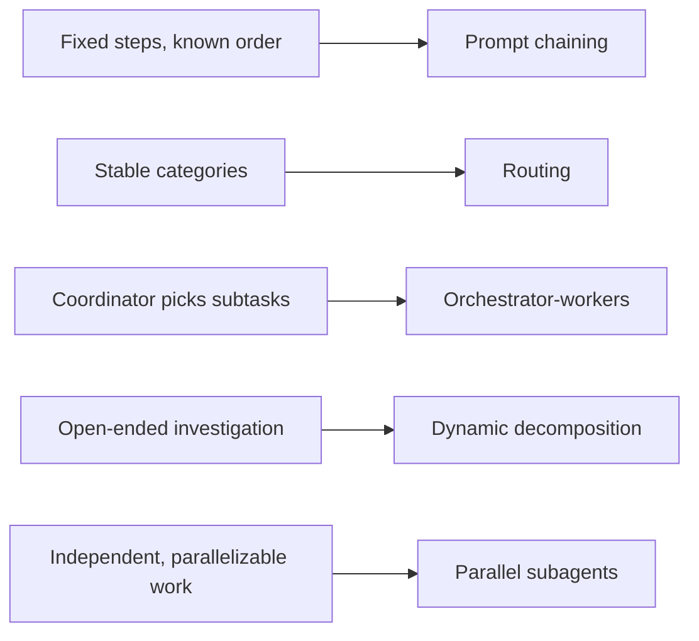

## Why this is the biggest domain

At 27% this is the single largest slice of CCAR-F — a bit over a quarter of
the exam by itself. It covers how agent loops actually terminate, how to
choose an orchestration pattern for a given shape of work, how coordinators
and subagents divide responsibility, and how to make agent behavior
_enforced_ rather than merely _requested_.

> **Exam tip:** almost every Agentic Architecture question is really asking
> "which pattern fits this shape of work?" — memorize the pattern-selection
> table below cold; a large share of this domain's questions are a
> restatement of it in scenario form.

## The agentic loop and `stop_reason`

- The agent loop is mechanical, not fuzzy: send messages → Claude responds →
  check `stop_reason` → act accordingly → repeat.
- **`stop_reason: "tool_use"`** → Claude wants to call a tool. Execute it,
  append the `tool_result` to the conversation, send again.
- **`stop_reason: "end_turn"`** → Claude is done; no more tool calls expected.
  Terminate the loop.

> **Gotcha:** don't parse Claude's natural-language text to decide whether to
> continue looping, and don't cap iterations with an arbitrary fixed number
> "just in case." The API tells you exactly when to stop via `stop_reason` —
> use that signal, not a heuristic layered on top of it.

```python
while True:
    response = client.messages.create(
        model="claude-sonnet-5",
        max_tokens=1024,
        tools=tools,
        messages=messages,
    )
    messages.append({"role": "assistant", "content": response.content})

    if response.stop_reason != "tool_use":
        break  # end_turn (or another terminal reason) — loop is done

    tool_results = [execute_tool(block) for block in response.content
                    if block.type == "tool_use"]
    messages.append({"role": "user", "content": tool_results})
```

## Orchestration pattern selection

> **Exam tip:** this table is the highest-yield single artifact in this
> domain. Scenario questions about "how should this system be structured"
> almost always reduce to picking a row.

| Pattern                   | Best for                                                                       | Avoid when                                                 |
| ------------------------- | ------------------------------------------------------------------------------ | ---------------------------------------------------------- |
| **Prompt chaining**       | Fixed, always-the-same-order workflow (A→B→C every time)                       | The next step genuinely depends on what was found          |
| **Routing**               | Distinct, stable categories (invoices vs. receipts vs. complaints)             | Categories are fuzzy, overlapping, or evolving             |
| **Orchestrator–workers**  | A coordinator decides which subtasks are needed, dynamically                   | A simple fixed chain would be cheaper and equally reliable |
| **Dynamic decomposition** | Open-ended investigation where each step's findings generate the next step     | The work is mechanical and already well-defined            |
| **Parallel subagents**    | Independent workstreams that don't depend on each other (N repos, N documents) | Workstreams depend on each other's output                  |



> **In practice:** a common trap is reaching for the fanciest pattern
> (dynamic decomposition, multi-agent) when the work is actually a fixed
> three-step chain. The exam rewards the _simplest_ pattern that fits the
> stated shape of work, not the most sophisticated-sounding one — see the
> "simplest fix that works" testing philosophy called out across the guide.

## Multi-agent coordination

- The **coordinator** owns all inter-subagent communication, error handling,
  and routing — subagents don't talk to each other directly.
- Spawn independent subagents **in parallel** by issuing multiple Task calls
  within a single coordinator turn; elapsed time becomes `max(subtask
durations)`, not the sum of them.
- Parallel execution requires a **uniform output shape** across subagents so
  the coordinator can synthesize results without special-casing each one.
- Use a forked session (`fork_session`) when you want to explore divergent
  approaches from a shared starting point without mutating the original
  session.

> **Gotcha:** a subagent **does not inherit the coordinator's conversation
> history**. If a subagent needs a fact the coordinator already knows, it has
> to be explicitly included in that subagent's prompt — goal, relevant
> findings so far, source references, constraints, and the expected output
> shape. Assuming context "just flows down" is one of the most common wrong
> answers in this domain.

> **Gotcha:** if a subagent fails, don't have the coordinator treat that as
> an empty/valid result — a silently-empty return prevents the coordinator
> from recovering or retrying. Subagents should return structured failure
> context: what was attempted, why it failed, any partial results, and
> whether it's worth retrying with a different approach.

### Context passed to a subagent — what belongs in it

```python
subagent_prompt = {
    "goal": "Summarize Q3 regulatory changes affecting section 4.",
    "relevant_findings": findings_so_far,       # only what THIS subagent needs
    "source_references": ["doc_12", "doc_19"],
    "constraints": "Cite section numbers; do not speculate beyond source text.",
    "expected_output_shape": {"summary": "str", "citations": "list[str]"},
}
```

## Task decomposition patterns

- **Prompt chaining** for a workflow that's always the same sequence of
  steps — each step's output feeds the next step's input directly.
- **Dynamic decomposition** for investigations where the next question
  depends on what the previous step discovered (e.g. "search for X, then
  based on what turns up, decide what to search for next").
- **Large code reviews:** split into a per-file local-issues pass (parallel,
  independent) plus a **separate** cross-file integration pass (sequential,
  needs the whole picture) — don't try to do both in one pass per file.

## Tool distribution — keep subagents narrow

- Give each subagent only the **4–5 tools** it actually needs for its role,
  not the full toolset. A broad tool set increases tool-selection complexity
  and causes role drift (a "research" subagent that starts editing files
  because it happens to have `Edit` available).

> **Gotcha:** "give every agent every tool, just in case" reads as
> convenient but is a wrong-answer pattern here — it's tested directly as
> "18 tools degrade selection quality; target 4–5 purpose-specific tools."

## Enforcement: hooks and prerequisite gates

- **Hooks** intercept the agent loop at defined points to normalize
  heterogeneous tool output and to _block_ policy violations outright —
  this is enforcement, not a suggestion layered into the prompt.
- A `PostToolUse` hook can inspect and transform a tool's raw output before
  the model ever reasons over it (e.g. redacting a field, rejecting a
  malformed response).
- **Prerequisite gates** make a required precondition structurally
  unavoidable rather than merely instructed — e.g. "verify the customer's
  identity" becomes a gate that blocks the refund tool from being callable
  until an `identity_verified` flag is set by an earlier step, instead of a
  system-prompt line asking the model to remember to check first.

> **Exam tip:** this is the domain's clearest expression of the
> programmatic-enforcement mental model from the [overview](/notes/ccar-f) —
> "add a stronger instruction telling Claude to check identity first" is
> reliably the wrong answer when "make identity-check a gate the refund tool
> can't bypass" is also an option.

## Guardrails aren't security boundaries by default

- Tool **annotation hints** (`readOnlyHint`, `destructiveHint`,
  `idempotentHint`, `openWorldHint` — shared vocabulary with the Tool Design
  & MCP domain) describe expected behavior for UI/display purposes. They are
  **not** enforced boundaries — a server could misreport them.
- Treat annotations as advisory metadata for humans and UIs, not as a
  substitute for actually checking permissions and side effects in code.

## State persistence for long-running or resumable agents

- Persist **structured exports** of progress, not raw transcripts —
  `completed_steps`, `open_gaps`, key decisions — so a resumed run injects
  only the relevant state into each (sub)agent rather than replaying an
  entire history.

```json
{
	"workflow_id": "research_2026_04_30",
	"completed_steps": ["source_search", "analysis"],
	"open_gaps": ["regulatory changes since Q2"]
}
```

- In multi-agent research/extraction workflows, require subagents to attach
  **provenance** to every claim they return: the claim itself, its source
  id, date, methodology, a confidence signal, and whether it's contested by
  another source. This is what lets a coordinator (or a human reviewer)
  trust — or challenge — a synthesized answer later.

## Common trap patterns in this domain

> **Gotcha:** running the **full multi-agent pipeline for a simple factual
> lookup** the coordinator could answer directly is a recurring wrong
> answer — orchestration overhead should be proportional to the complexity
> of the work, not applied uniformly to every request.

> **Gotcha:** treating **self-reported confidence scores** from a subagent
> as a reliable routing signal for "does this need human review?" — they're
> often poorly calibrated. Prefer structured `requires_review` flags with
> explicit reasons over a bare numeric confidence value.

## Scenario spotlight: Multi-Agent Research System

This is one of the six scenario banks and leans heavily on this domain —
expect questions combining: coordinator/subagent responsibility split,
parallel launch of independent research subagents, provenance requirements
on returned claims, and recovery behavior when one subagent's search comes
back empty vs. fails outright (empty ≠ failure — don't conflate them in the
coordinator's handling).

### Further reading

- [Building Effective Agents](https://www.anthropic.com/engineering/building-effective-agents) — the canonical source for workflows vs. agents and the five orchestration patterns.
- [Effective context engineering for AI agents](https://www.anthropic.com/engineering/effective-context-engineering-for-ai-agents) — compaction, structured note-taking, and sub-agent strategies for long-running agents.
- [Agent SDK overview](https://code.claude.com/docs/en/agent-sdk/overview) — built-in tools, context management, permissions, sessions, sub-agents.
- [Create custom subagents](https://code.claude.com/docs/en/sub-agents) — the full `.claude/agents/*.md` file format, frontmatter fields, scopes, hooks.
- [Subagents in the SDK](https://code.claude.com/docs/en/agent-sdk/subagents) — defining subagents programmatically with `AgentDefinition`, invoking and restricting them.
- [Tool use overview](https://platform.claude.com/docs/en/agents-and-tools/tool-use/overview) — the tool-use loop and `stop_reason` mechanics underlying the loop-control section above.
