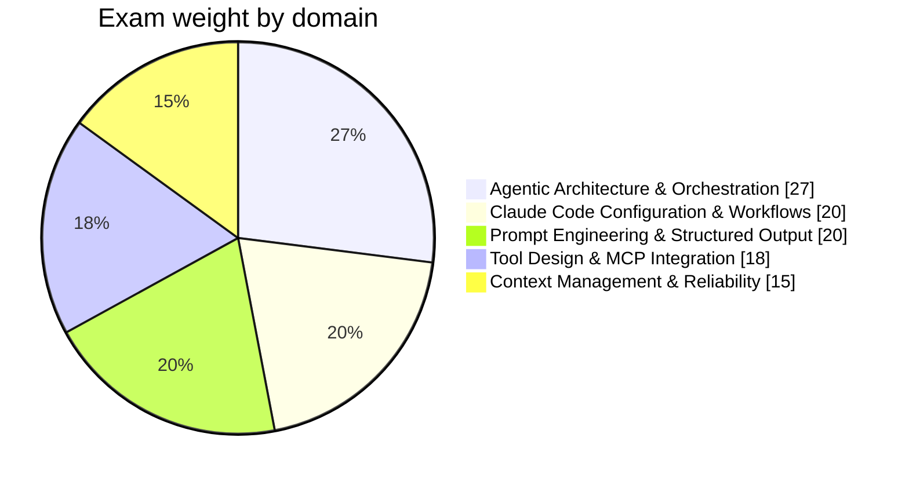

## What CCAR-F actually tests

> **Exam tip:** CCAR-F is **scenario-based, not trivia-based**. You aren't
> answering isolated questions — the exam draws **4 of 6 possible production
> scenarios** (see below), and every question on your exam anchors back to
> whichever 4 you got. Read each question as "you are the architect of _this
> specific system_," not as an abstract API-knowledge check.

- **Format:** 60 scenario-anchored questions, **120 minutes**.
- **Passing score:** 720 / 1000 (scaled score, not a raw percent — don't try
  to back-solve "how many can I miss").
- **Structure:** the exam bank has **six** production-design scenarios; your
  attempt draws **four** of them at random, and all 60 questions reference
  one of your four. The six are:
  1. Customer Support Resolution Agent
  2. Code Generation with Claude Code
  3. Multi-Agent Research System
  4. Developer Productivity with Claude
  5. Claude Code for Continuous Integration
  6. Structured Data Extraction
- **Vendor:** Anthropic. Validates the ability to make sound _architectural_
  decisions for production Claude systems — agentic orchestration, tool/MCP
  design, Claude Code configuration, prompt/output engineering, and
  context/reliability management — not raw API syntax recall.
- **Credential validity:** 12 months.

> **Note:** this is Anthropic's **Architect** tier, one level up from the
> Developer (CCDV-F) exam. If you've studied CCDV-F, the API mechanics
> (messages, tools, streaming) are assumed background — CCAR-F tests what you
> _do_ with that mechanic at the system-design level: where responsibility
> should live, which pattern fits a given failure mode, and what the
> "least-bad" tradeoff is when no option is perfect.

## Domain weighting (study time should roughly follow this)

| Domain                                                                          | Weight | ~Questions on exam |
| ------------------------------------------------------------------------------- | ------ | ------------------ |
| [Agentic Architecture & Orchestration](#agentic-architecture-orchestration)     | 27%    | ~16                |
| [Claude Code Configuration & Workflows](#claude-code-configuration-workflows)   | 20%    | ~12                |
| [Prompt Engineering & Structured Output](#prompt-engineering-structured-output) | 20%    | ~12                |
| [Tool Design & MCP Integration](#tool-design-mcp-integration)                   | 18%    | ~11                |
| [Context Management & Reliability](#context-management-reliability)             | 15%    | ~9                 |

> **Note:** weighting here is noticeably flatter than CCDV-F's (whose top
> domain alone was a third of the exam). No single CCAR-F domain dominates —
> **Agentic Architecture** is the biggest single lever at just over a
> quarter, but the other four domains are all close enough together (15–20%)
> that skipping any one of them is a real risk. Don't over-invest in
> Agentic Architecture at the expense of the rest.

## The one mental model that ties every domain together

> **Exam tip:** the single most-tested idea across all five domains, in one
> sentence: **{{Programmatic enforcement|Compliance-critical or irreversible
> decisions must be enforced in code (hooks, gates, schemas, permission
> checks) — never left to an LLM "usually" following an instruction.}}
> beats prompt guidance whenever the stakes are real.** When a question
> offers "add a stronger instruction to the system prompt" against "add a
> code-level check," and money, identity, or an irreversible action is on the
> line, the code-level check wins essentially every time.
>
> This shows up under different names in every domain: hooks and prerequisite
> gates (Agentic Architecture), JSON-schema-backed tool_use instead of
> prompt-only JSON (Prompt Engineering), settings.json permission rules
> instead of a CLAUDE.md request (Claude Code), structured tool error
> contracts instead of hoping the model infers retryability (Tool Design),
> and idempotency keys instead of trusting the model not to double-submit
> (Context Management & Reliability).

## How to use these notes

- Written **bullet-first**: skim the bullets for the "point to ponder," read
  the surrounding prose only when a bullet needs unpacking.
- **Bold** = a term or fact worth memorizing verbatim. _Italics_ = a softer
  emphasis or nuance. `code font` = an exact API field, config key, CLI flag,
  or identifier — the exam frequently tests exact field names
  (`stop_reason`, `tool_choice`, `isError`, `.mcp.json`, ...).
- Dotted-underline terms (like {{idempotency|Property where making the same
  request multiple times has the same effect as making it once — the
  standard fix for "timeout after a write" ambiguity.}}) carry a hover/tap
  definition — use them on mobile too.
- Diagrams are [Mermaid](https://mermaid.js.org/) flowcharts/sequence
  diagrams.
- Blockquotes are call-outs: **Exam tip** (what the test likes to ask),
  **Gotcha** (common wrong-answer trap), **Note** (background context),
  **In practice** (real-world color that isn't necessarily exam-tested).
- This is a _supplement_, not a replacement for hands-on system design —
  pair it with the [Practice mode](/practice) and revisit any domain where
  your practice accuracy is below ~80%.

## Suggested study order

1. Start with [Agentic Architecture & Orchestration](#agentic-architecture-orchestration)
   — the largest single domain, and its vocabulary (loop control, coordinator/
   subagent patterns, hooks as enforcement) recurs inside every other domain.
2. Then [Tool Design & MCP Integration](#tool-design-mcp-integration) — how
   tools are described and scoped directly shapes agent behavior and comes
   up again in the Agentic Architecture and Context domains.
3. Then [Prompt Engineering & Structured Output](#prompt-engineering-structured-output)
   — schema-backed output vs. prompt-only JSON is one of the most repeated
   trap patterns on the exam.
4. Then [Context Management & Reliability](#context-management-reliability)
   — long-conversation handling, escalation, and error propagation build on
   the tool and prompt vocabulary above.
5. Finish with [Claude Code Configuration & Workflows](#claude-code-configuration-workflows)
   — CLAUDE.md hierarchy, hooks, and CI/CD integration are concrete and fast
   to review last, close to exam day.
6. Read all **six** scenario summaries at least once, even though only four
   land on your specific attempt — they cross-reference every domain and
   reinforce material more efficiently than reading definitions in isolation.
7. Do at least one full-length, timed [Mock Exam](/exam) before the real
   thing to calibrate pacing (120 minutes ÷ 60 questions = **2 min/question**;
   scenario questions read longer than CCDV-F's, so bank extra time on the
   first question of each new scenario block and move faster once you're
   oriented in it).

### Exam-taking strategy

> **Exam tip:** for every question, first ask **"where should responsibility
> live?"** — model (interpret, adapt, synthesize), application code
> (permissions, compliance, retries, validation, auditability), or tool/schema
> design (shape what the model can even attempt). Most correct answers fall
> out once you've placed the responsibility correctly.

- **No option is "best," only "least-bad for this scenario."** Prompt
  chaining trades adaptability for reliability; routing trades flexibility
  for clarity; batch API trades latency for cost. The exam rewards
  identifying the right tradeoff for the stated constraints, not reciting a
  pattern's definition.
- **Prefer concrete over abstract.** "If the tool times out after submission,
  return `{"uncertain_state": true}` and do not auto-retry" beats "handle
  errors gracefully" as a mental model for what a correct answer sounds like.
- **Schema-backed beats prompt-only, almost without exception.** Whenever a
  question offers "ask nicely for JSON" against "use a JSON Schema / forced
  tool_use," pick the schema-backed option.
- **Money, identity, or an irreversible action in the scenario → the answer
  is code-level enforcement**, not a stronger-worded instruction.
- Distinguish **transient** failures (retry with backoff) from **permanent**
  ones (return structured detail, let the caller decide) from **uncertain
  write state** (don't auto-retry — that's how duplicates happen).

### Further reading

- [Anthropic API documentation](https://docs.claude.com/) — Messages API,
  tool use, and Agent SDK reference underlying every domain below.
- [Claude Agent SDK documentation](https://docs.claude.com/en/api/agent-sdk/overview) —
  orchestration, subagents, and hooks referenced throughout Agentic
  Architecture and Claude Code Configuration.
- [Model Context Protocol specification](https://modelcontextprotocol.io/) —
  primary source for the Tool Design & MCP Integration domain.
