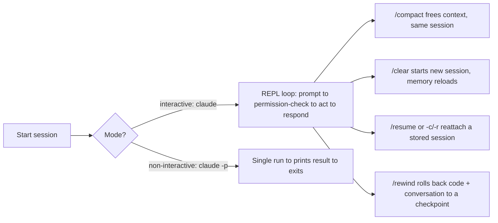
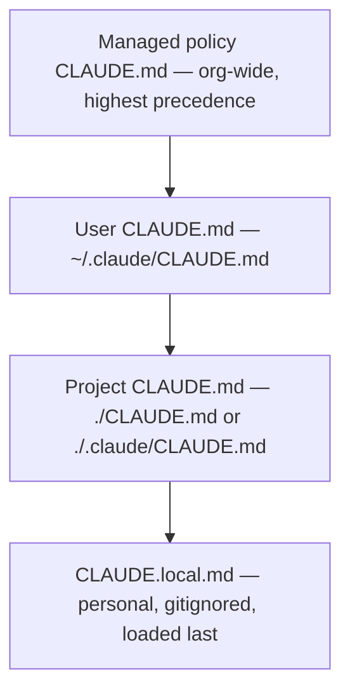
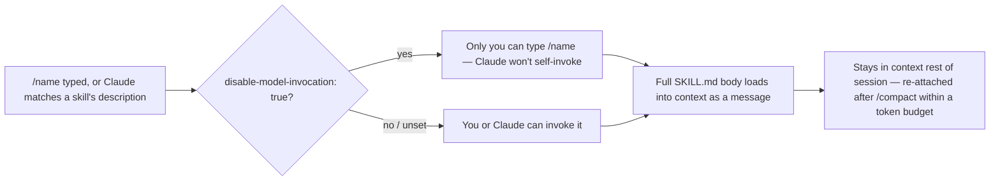

## Claude Code fundamentals

> **Exam tip:** the exam weights this domain small (3.1%, ~2 questions), but questions tend to be precise about *exact file names* and *exact precedence order* — memorize those over vague concepts.

- **Claude Code** is Anthropic's **agentic coding tool**: it reads your codebase, edits files, runs shell commands, and drives git — not just autocomplete-style suggestions inside an editor.
- Ships as a full-featured **terminal CLI** (`claude`), plus surfaces that share the same underlying engine: **VS Code** / **JetBrains** IDE extensions, a **desktop app**, and a **web** version at `claude.ai/code`. `CLAUDE.md` files, settings, and MCP servers work identically across all of them.
- {{agentic coding|Claude plans an approach, takes multiple actions (read, edit, run, test) across turns, and verifies its own work — as opposed to a single-shot autocomplete suggestion a human must apply and check.}} is the key differentiator from traditional "coding assistant" tools: Claude Code is *proactive* — it can execute a task end-to-end (e.g. "write tests for the auth module, run them, and fix failures") rather than just proposing a diff.
- Core capabilities to remember:
  - Reads and edits files directly in your project.
  - Runs terminal commands (build, test, lint, install packages).
  - Works with **git**: stages changes, writes commit messages, creates branches, opens PRs.
  - Connects to external tools via **MCP** (Model Context Protocol) — e.g. Jira, Slack, Google Drive.
  - Composable/scriptable — follows the **Unix philosophy**: you can pipe data into it and chain it with other CLI tools.
- Integrates into a **broader dev workflow**, not just ad-hoc chat:
  - **CI/CD**: GitHub Actions, GitLab CI/CD — automate PR review and issue triage.
  - **Code review**: automatic review on every PR.
  - **Scheduling**: recurring tasks (`/schedule`, Routines, `/loop`) for jobs like morning PR reviews or dependency audits.
  - **Chat ops**: mention `@Claude` in Slack to route a bug report into a PR.

```bash
# One-off task from the shell
claude "write tests for the auth module, run them, and fix any failures"

# Works with Unix pipes
tail -200 app.log | claude -p "Slack me if you see any anomalies"
```

## Interaction modes & session management

- **Interactive mode** (default): run `claude` (optionally with an initial prompt) to start a persistent, conversational **REPL**-like session — real-time back-and-forth, permission prompts appear as Claude wants to act, and you can steer mid-task.
- **Non-interactive / print mode** (`-p` / `--print`): `claude -p "query"` runs once, prints the result, and exits — built for **automation, CI/CD, and scripting**. Accepts piped stdin (`cat file | claude -p "..."`).
  - `--output-format` controls machine-readable output: `text` (default), `json` (structured), `stream-json` (streaming events) — essential for parsing Claude Code's output in a pipeline.
  - Scripting flags worth knowing: `--max-turns` (cap agentic turns, print mode only), `--max-budget-usd` (spending cap), `--dangerously-skip-permissions` (skip prompts — use with care), `--permission-mode` (start in a given mode, e.g. `plan`, `acceptEdits`, `bypassPermissions`).
- **Session persistence & resuming** — sessions are stored locally and are searchable across projects/worktrees on your machine:

| Flag | Purpose |
| --- | --- |
| `--continue` / `-c` | Resume the most recent conversation in the current directory |
| `--resume` / `-r` | Resume a specific session by ID or name (interactive picker if none given) |
| `--session-id` | Pin a session to a specific UUID |
| `--fork-session` | Branch off a new session ID while resuming, preserving history |
| `--name` / `-n` | Give the session a display name |

- In-session slash commands for session/context management (all verified against the current commands reference):
  - `` `/resume [session-id|name]` `` — return to an earlier conversation; without an argument opens an interactive picker. Restores conversation history and context, but **not** uncommitted code changes. Alias `` `/back` ``.
  - `` `/clear [name]` `` (aliases `` `/reset` ``, `` `/new` ``) — start fresh **but keep project memory** (`CLAUDE.md` still loads).
  - `` `/compact [instructions]` `` — summarize the conversation to free context **while continuing the same session** (preserves rules, skills, memory files).
  - `` `/context [all]` `` — visualize current context-window usage as a colored grid; also the way to confirm which memory files actually loaded.
  - `` `/rewind [N|all|to <name>]` `` — roll code *and* conversation back to an earlier checkpoint. Without an argument, opens an interactive menu.
  - `` `/fork [prompt]` `` — copy the current conversation into a **new background session** (useful for trying a risky alternate direction without losing the current one).
  - `` `/branch [name]` `` — create a named branch of the current conversation.

> **Gotcha:** `/clear` and `/compact` are *not* the same. `/clear` wipes context and starts a new conversation (project memory reloads fresh). `/compact` shrinks the *current* conversation's context via summarization without ending it.

- Every session starts with a **fresh context window**; two mechanisms carry knowledge forward across sessions: `CLAUDE.md` files (instructions *you* write) and **auto memory** (notes *Claude* writes itself about your corrections/preferences, stored under `~/.claude/projects/<project>/memory/`, entry point `MEMORY.md`, capped at the first **200 lines or 25KB** loaded per session).
- After `/compact`, the **project-root `CLAUDE.md` survives** — Claude re-reads it from disk and re-injects it. Nested `CLAUDE.md` files and path-scoped rules are *not* auto re-injected; they reload only when Claude next touches a matching file.



> **In practice:** `--dangerously-skip-permissions` (equivalent to `--permission-mode bypassPermissions`) is genuinely useful in disposable sandboxes/CI where nothing Claude touches matters if it goes wrong — but running it against a real working directory means Claude can run `rm`, force-push, or edit anything with zero prompts. Prefer scoping specific `allow` rules in `settings.json` (see below) over reaching for this flag by default.

## CLAUDE.md configuration hierarchy

- `` `CLAUDE.md` `` is a plain markdown file Claude Code **automatically reads at the start of every session** to get persistent project context: build/test commands, coding standards, architecture notes, conventions.
- Claude Code reads `CLAUDE.md`, **not** `AGENTS.md`. If a repo already has `AGENTS.md` for other tools, create a `CLAUDE.md` that does `@AGENTS.md` (import syntax) so both stay in sync, or symlink it (`ln -s AGENTS.md CLAUDE.md` — on Windows this needs Administrator/Developer Mode, so prefer the `@AGENTS.md` import there).
- Run `` `/init` `` to auto-generate a starting `CLAUDE.md` from the codebase; it suggests improvements rather than overwriting an existing one. Run `` `/memory` `` to view/edit all memory files in a session, and `` `/context` `` to confirm what actually loaded.

> **Exam tip:** know the **precedence/load order**, broadest scope to narrowest — a project instruction is read *after* (and thus can refine) a user instruction, because all files are concatenated into context rather than one overriding another.

| Scope | Location | Purpose | Shared with |
| --- | --- | --- | --- |
| **Managed / enterprise policy** | macOS `/Library/Application Support/ClaudeCode/CLAUDE.md`; Linux/WSL `/etc/claude-code/CLAUDE.md`; Windows `C:\Program Files\ClaudeCode\CLAUDE.md` | Org-wide instructions from IT/DevOps (compliance, security policy) — cannot be excluded by individual settings | All users in the org |
| **User instructions** | `~/.claude/CLAUDE.md` | Personal preferences across all projects | Just you |
| **Project instructions** | `./CLAUDE.md` or `./.claude/CLAUDE.md` | Team-shared architecture/standards, checked into version control | Team via source control |
| **Local instructions** | `./CLAUDE.local.md` | Personal, project-specific preferences (sandbox URLs, test data) — add to `.gitignore` | Just you, this project |

- **All discovered files are concatenated into context — later files don't override earlier ones**, they're read in addition. Claude Code walks up the directory tree from your working directory, loading every `CLAUDE.md`/`CLAUDE.local.md` it finds; content is ordered **root-first**, so the file closest to where you launched Claude is read *last* (and `CLAUDE.local.md` is appended right after its sibling `CLAUDE.md`).
- Nested `CLAUDE.md` files in **subdirectories below** your working directory are *not* loaded at launch — they load on demand only when Claude reads a file in that subdirectory.
- Files can **import** other files with `` `@path/to/file` `` syntax (relative or absolute); imports can recurse up to **4 hops deep**. Wrap a path in backticks (`` `@README` ``) to mention it literally without importing. An import that resolves *outside* your working directory (e.g. `@~/.claude/my-notes.md` from a project file) triggers a one-time approval dialog the first time Claude Code encounters it.
- **Size matters for adherence**: target **under 200 lines** per `CLAUDE.md` — CLAUDE.md content is delivered as a user message (not the system prompt), so it's context, not hard enforcement, and longer files reduce how reliably Claude follows them.
- For larger projects, split instructions into `` `.claude/rules/*.md` `` — see the Rules row in the table below. Rules can be scoped with `paths:` frontmatter (glob patterns) so they only load when Claude touches matching files.
- Use `claudeMdExcludes` (any settings layer) in monorepos to skip irrelevant ancestor `CLAUDE.md` files from other teams.



> **Gotcha:** "highest precedence" here means loaded *first* / broadest scope — not "wins a conflict and hides the rest." Since files are concatenated rather than overridden, contradictory instructions across files can make Claude pick one **arbitrarily**; keep instructions consistent and review periodically.

### What a real CLAUDE.md looks like

A project `CLAUDE.md` is not a mission statement — it's the stuff you'd otherwise retype into chat every session: exact commands, naming conventions, and pitfalls specific to *this* codebase (not things Claude could already infer by reading the code).

```markdown
## Build & test
- Install deps: `npm install`
- Dev server: `npm run dev`
- Run all tests: `npm test`
- Run a single test file: `npm test -- src/lib/foo.test.ts`
- Lint (must pass before committing): `npm run lint`

## Conventions
- Components use PascalCase filenames; utilities use camelCase.
- Prefer named exports over default exports.
- Every new API route needs a matching test under `tests/api/`.
- Do not hand-edit files under `src/generated/` — they're regenerated by `npm run codegen`.

## Architecture notes
- `src/lib/server/` is server-only; never import it from `src/lib/client/`.
- Auth flow lives in `src/lib/server/auth.ts` — see `@docs/auth.md` for the full sequence.

## Git workflow
- Branch from `main`, prefix branches `feat/` or `fix/`.
- Squash-merge PRs; write commit subjects in the imperative mood ("Add", not "Added").
```

> **In practice:** treat `CLAUDE.md` as a living document, not a one-time setup step. When Claude makes the same mistake twice, or a code review catches something it should have known, that's the signal to add a line — either by asking Claude to "add this to CLAUDE.md," or editing it yourself via `` `/memory` ``.

## Real `.claude/settings.json` structure

- `settings.json` configures Claude Code's *behavior* (permissions, hooks, environment, model) — distinct from `CLAUDE.md`, which configures Claude's *instructions*. Settings are enforced by the client regardless of what Claude decides; `CLAUDE.md` is context Claude may or may not follow.

| Scope | Path | Shared with |
| --- | --- | --- |
| **User** | `~/.claude/settings.json` | Just you, all projects |
| **Project** | `.claude/settings.json` | Team, via source control |
| **Local** | `.claude/settings.local.json` | Just you, this project (gitignored) |
| **Managed (macOS)** | `/Library/Application Support/ClaudeCode/managed-settings.json` | All users on the machine / org |
| **Managed (Linux/WSL)** | `/etc/claude-code/managed-settings.json` | All users on the machine / org |
| **Managed (Windows)** | `C:\Program Files\ClaudeCode\managed-settings.json` | All users on the machine / org |

- **Precedence when the same key is set in multiple files** (highest wins): **Managed** > **CLI arguments** > **Local** (`.claude/settings.local.json`) > **Project** (`.claude/settings.json`) > **User** (`~/.claude/settings.json`). Permission rules are the exception — they **merge** across scopes rather than the highest scope replacing the rest.
- Real top-level fields you'll actually use day to day: `` `permissions` `` (allow/deny/ask rules for tools), `` `hooks` `` (deterministic shell commands at lifecycle events), `` `env` `` (environment variables injected into every session), `` `model` `` (default model, read once at session start — use `` `/model` `` to change mid-session instead), `` `cleanupPeriodDays` `` (how long session files are kept, default 30), `` `claudeMdExcludes` ``, `` `autoMemoryEnabled` ``.

```json
{
  "$schema": "https://json.schemastore.org/claude-code-settings.json",
  "model": "claude-sonnet-5",
  "permissions": {
    "allow": [
      "Bash(npm run lint)",
      "Bash(npm run test *)",
      "Read(~/.zshrc)"
    ],
    "deny": [
      "Bash(curl *)",
      "Read(./.env)",
      "Read(./.env.*)",
      "Read(./secrets/**)"
    ]
  },
  "env": {
    "CLAUDE_CODE_ENABLE_TELEMETRY": "1"
  },
  "hooks": {
    "PostToolUse": [
      {
        "matcher": "Edit|Write",
        "hooks": [
          { "type": "command", "command": "jq -r '.tool_input.file_path' | xargs npx prettier --write" }
        ]
      }
    ]
  },
  "cleanupPeriodDays": 30
}
```

- Permission rules use `` `Tool(pattern)` `` syntax — e.g. `` `Bash(npm run test *)` `` allows that exact prefix with any trailing arguments, `` `Read(./secrets/**)` `` denies a path glob. `allow`, `deny`, and (less commonly) `ask` are the three rule lists.
- **Hooks** fire on lifecycle events like `` `PreToolUse` `` (before a tool runs, can block it), `` `PostToolUse` `` (after it succeeds), `` `Notification` ``, `` `SessionStart` ``, `` `Stop` ``. Each entry pairs a `matcher` (which tool(s)) with one or more `` `{ "type": "command", "command": "..." }` `` handlers.

> **Exam tip:** if a question asks "how do I guarantee X always happens," the answer is a **hook** in `settings.json`, not a `CLAUDE.md` instruction — hooks are enforced by the client; `CLAUDE.md`/Rules/Skills only shape what Claude *chooses* to do.

> **In practice:** run `` `/hooks` `` in a session to browse configured hook events read-only, and `` `/permissions` `` to open the interactive permissions editor instead of hand-editing the JSON — both write back to the correct settings file for you.

## Rules, Skills, Commands, and (Sub)Agents

- These four mechanisms are how you extend and customize Claude Code beyond plain conversation. They differ mainly in **when their content loads** and **who can trigger them**.

| Mechanism | Purpose | File location | How invoked / loaded |
| --- | --- | --- | --- |
| **Rules** | Modular, topic-specific instructions split out of a growing `CLAUDE.md` (e.g. `testing.md`, `security.md`); can be scoped to file paths | `.claude/rules/*.md` (project), `~/.claude/rules/` (user) | Loaded at session start (same priority as `CLAUDE.md`) *unless* they carry `paths:` frontmatter — then they load only when Claude opens a matching file |
| **Skills** | Package a repeatable, reusable procedure/workflow/checklist so it doesn't bloat `CLAUDE.md`; loads on demand rather than every session | `.claude/skills/<name>/SKILL.md` (project), `~/.claude/skills/<name>/SKILL.md` (personal), or a plugin's `skills/` dir | Claude can auto-invoke when relevant (its `description` decides), or you invoke directly with `` `/skill-name` `` |
| **Commands** | The original "type `/name`" mechanism; **now merged into Skills** — a file at `.claude/commands/deploy.md` behaves like a skill and creates `` `/deploy` `` | `.claude/commands/*.md` (project), `~/.claude/commands/` (personal) | Typed at the start of a message: `/command arg1 arg2`; only recognized as the first token of a message; supports the same frontmatter as `SKILL.md` |
| **(Sub)Agents** | Specialized assistants with their **own context window**, system prompt, and restricted tool access — used for side tasks that would otherwise flood the main conversation (e.g. large search results, log dumps) | `.claude/agents/*.md` (project), `~/.claude/agents/` (user), or a plugin's `agents/` dir | Automatic delegation (Claude matches task to a subagent's `description`), explicit `@-mention`, or run the whole session as that agent via `--agent <name>` |

> **Note:** if a project has both a skill and a command with the same name, the **skill takes precedence**. Existing `.claude/commands/*.md` files keep working unchanged — Skills only *added* optional features (a folder for supporting files, `context: fork`, richer frontmatter) on top of the same mechanism.

### Real slash command / skill file structure

Both `.claude/commands/<name>.md` and `.claude/skills/<name>/SKILL.md` create a `` `/name` `` command from YAML frontmatter + a Markdown body. Only `description` is recommended; everything else is optional. Verified frontmatter fields worth knowing:

| Field | Description |
| --- | --- |
| `` `description` `` | What it does and when to use it — this is what Claude reads to decide whether to auto-invoke it |
| `` `argument-hint` `` | Autocomplete hint, e.g. `[issue-number]` |
| `` `arguments` `` | Named positional arguments (space-separated string or YAML list) for `$name` substitution |
| `` `disable-model-invocation` `` | `true` = only *you* can trigger it via `/name`; Claude won't run it on its own (good for `/deploy`, `/commit`) |
| `` `user-invocable` `` | `false` = only *Claude* can trigger it; hidden from the `/` menu (good for background reference knowledge) |
| `` `allowed-tools` `` | Pre-approves specific tools for the turn that invokes it, so Claude doesn't prompt for permission |
| `` `model` `` | Overrides the model for the turn this skill/command is active |
| `` `context` `` | `fork` = runs in an isolated **subagent** context rather than inline in the current conversation |
| `` `agent` `` | Which subagent type to use when `context: fork` is set (defaults to `general-purpose`) |

Argument placeholders inside the body: `` `$ARGUMENTS` `` (everything typed after the command name), `` `$ARGUMENTS[N]` `` / `` `$N` `` (a single argument by **zero-based** index — `$0` is the *first* argument, `$1` the second), or `` `$name` `` for a name declared in the `arguments` frontmatter list.

A complete minimal command file:

```markdown
---
description: Fix a GitHub issue by number, following our coding standards
argument-hint: [issue-number]
allowed-tools: Bash(gh issue view *), Bash(gh pr create *)
---

Fix GitHub issue $ARGUMENTS following our coding standards.

1. Read the issue: `gh issue view $ARGUMENTS`
2. Implement the fix and add tests
3. Open a PR: `gh pr create`
```

Saved as `.claude/commands/fix-issue.md`, typing `` `/fix-issue 123` `` sends Claude "Fix GitHub issue 123 following our coding standards...".

> **In practice:** `$1` is **not** the first argument — it's the second (`$0` is first). This trips people up coming from shell scripts where `$1` is conventionally the first positional arg. If you only ever use one argument, `$ARGUMENTS` is the safer choice over indexed placeholders.

### Real Skill file structure

A Skill directory can bundle more than instructions — scripts, templates, reference docs — which is what distinguishes it from a plain command file:

```
my-skill/
├── SKILL.md           # required — frontmatter + instructions
├── reference.md        # detailed docs, loaded only when Claude follows a link to it
├── examples.md
└── scripts/
    └── validate.sh     # a script Claude can execute
```

```markdown
---
name: deploy
description: Deploy the application to production
disable-model-invocation: true
allowed-tools: Bash(npm run build), Bash(npm run deploy)
---

Deploy the application:
1. Run the test suite
2. Build the application
3. Push to the deployment target
```

- **Where skills live and precedence when names collide**: enterprise (managed) overrides personal, personal overrides project (`~/.claude/skills/` beats `.claude/skills/`). Any of those overrides a same-named **bundled** skill (Claude Code ships built-ins like `` `/code-review` ``, `` `/security-review` ``, `` `/verify` ``, `` `/loop` ``, `` `/debug` ``). Plugin skills use a `` `plugin:skill` `` namespace so they never collide.
- Skill content is injected as a message the **first** time it's invoked and then **stays in context** for the rest of the session — Claude Code doesn't re-read the file on later turns, so write standing instructions rather than one-time steps. It also survives `/compact` up to a shared token budget.

### Real subagent file structure

```markdown
---
name: code-reviewer
description: Reviews code for quality and best practices
tools: Read, Glob, Grep
model: sonnet
---

You are a code reviewer. When invoked, analyze the code and provide
specific, actionable feedback on quality, security, and best practices.
```

- **Required fields**: `name`, `description`. **Common optional fields**: `` `tools` `` / `` `disallowedTools` `` (restrict capability — a subagent whose `tools` list resolves to nothing fails to launch), `` `model` `` (`sonnet`, `opus`, `haiku`, `fable`, a full model ID, or `inherit`), `` `permissionMode` `` (`default`, `acceptEdits`, `plan`, `auto`, `dontAsk`, `bypassPermissions`), `` `skills` `` (preload specific skills' full content at startup), `` `isolation: worktree` `` (give it its own git worktree), `` `background` ``.
- **Built-in subagents** ship out of the box: **Explore** (fast, read-only codebase search — as of recent versions it inherits the main session's model, capped at Opus on the Claude API, rather than always running on Haiku), **Plan** (research during plan mode), **general-purpose** (multi-step research + edits, every tool available to subagents). Explore and Plan intentionally skip loading `CLAUDE.md` and git status to stay fast/cheap.
- **Precedence when names collide is *not* the same order for every mechanism** — a common exam trap:
  - **Skills**: enterprise overrides personal, and personal overrides project.
  - **Subagents**: managed settings > `--agents` CLI flag > project `.claude/agents/` > personal `~/.claude/agents/` > plugin — here **project beats personal**, the opposite ordering from skills.

> **Gotcha:** skills resolve personal-before-project, subagents resolve project-before-personal. Don't assume one ordering applies to both.

> **In practice:** editing a subagent or skill file on disk (or asking Claude to write one) takes effect within the same session, no restart needed — Claude Code watches `.claude/agents/`, `~/.claude/agents/`, `.claude/skills/`, and `~/.claude/skills/` for changes. The one exception is creating the **first** file in a brand-new `agents/` or `skills/` directory that didn't exist when the session started — that needs a restart so the watcher picks up the new directory.

> **Note:** Claude Code also supports **Hooks** — shell commands that fire deterministically at fixed lifecycle events (e.g. `PreToolUse`, `PostToolUse`, auto-formatting after every edit, blocking a disallowed Bash command). Unlike `CLAUDE.md`/Rules/Skills (which are *context* Claude may or may not follow), hooks are **enforced regardless of what Claude decides** — this is the tool to reach for when an instruction like "always run the linter before commit" absolutely must happen. See the real `.claude/settings.json` example above for the exact JSON shape.



## CLI reference

A curated, verified subset — see the official CLI reference for the full flag list (there are well over a hundred).

| Command | Purpose |
| --- | --- |
| `claude` | Start an interactive session |
| `claude "prompt"` | Start interactive, with an initial prompt |
| `claude -p "prompt"` / `--print` | Non-interactive: run once, print the result, exit |
| `claude -c` / `--continue` | Resume the most recent conversation in this directory |
| `claude -r "<id-or-name>"` / `--resume` | Resume a specific session; opens a picker if no argument given |
| `claude update` | Update Claude Code to the latest version |
| `claude doctor` | Print setup diagnostics without starting a session |
| `claude mcp` | Configure MCP servers |
| `claude auth login` / `claude auth status` | Sign in / check authentication status |

| Flag | Purpose |
| --- | --- |
| `--model` | Set the model for this invocation |
| `--permission-mode` | Start in a given mode: `default`, `acceptEdits`, `plan`, `bypassPermissions`, etc. |
| `--dangerously-skip-permissions` | Skip all permission prompts (equivalent to `--permission-mode bypassPermissions`) |
| `--output-format` | `text` (default), `json`, or `stream-json` |
| `--max-turns` | Cap the number of agentic turns (print mode only) |
| `--max-budget-usd` | Stop once this much has been spent |
| `--add-dir` | Grant access to additional working directories for this session |
| `--session-id` | Pin the session to a specific UUID |
| `--fork-session` | Branch off a new session ID while resuming, preserving history |
| `--agents` | Define subagent(s) for this session only, via inline JSON |
| `--settings` | Path to a settings JSON file, or inline JSON, layered on top of the normal files |

Verified, commonly-used in-session slash commands beyond the session-management ones covered above:

| Command | Purpose |
| --- | --- |
| `` `/help` `` | Show help and available commands |
| `` `/agents` `` | Reminder to ask Claude to create/manage subagents (recent versions removed the interactive wizard in favor of editing `.claude/agents/` directly, or asking Claude) |
| `` `/mcp` `` | Manage MCP server connections and OAuth authentication |
| `` `/permissions` `` | Open the interactive permissions editor |
| `` `/model [model]` `` | Set the model for this session; no argument opens a picker |
| `` `/skills` `` | View, create, edit, and manage skills |
| `` `/hooks` `` | Browse configured hook events (read-only — edit `settings.json` to change them) |
| `` `/doctor` `` | Run a setup checkup that diagnoses configuration issues |
| `` `/status` `` | One-line summary: working directory, model, effort level, active goal/background work |
| `` `/cost` `` | Alias for `` `/usage` `` — token usage for the session and billing period |
| `` `/code-review` `` / `` `/security-review` `` | Bundled skills that review the current diff (or a PR/branch/path) for correctness or security issues |

### Further reading

- [Claude Code overview](https://code.claude.com/docs/en/overview) — what Claude Code is, install methods, surfaces, and workflow integrations.
- [How Claude remembers your project](https://code.claude.com/docs/en/memory) — full `CLAUDE.md` hierarchy, `.claude/rules/`, imports, and auto memory.
- [Extend Claude with skills](https://code.claude.com/docs/en/skills) — `SKILL.md` structure, frontmatter reference, invocation control, custom commands.
- [Create custom subagents](https://code.claude.com/docs/en/sub-agents) — subagent scope, frontmatter fields, tool/permission restriction.
- [Slash commands reference](https://code.claude.com/docs/en/commands) — the full built-in command list.
- [CLI reference](https://code.claude.com/docs/en/cli-reference) — every flag, session management, output formats, scripting.
- [Settings](https://code.claude.com/docs/en/settings) — `settings.json` fields, file locations, precedence.
- [Automate actions with hooks](https://code.claude.com/docs/en/hooks-guide) — hook events, configuration shape, worked examples.
