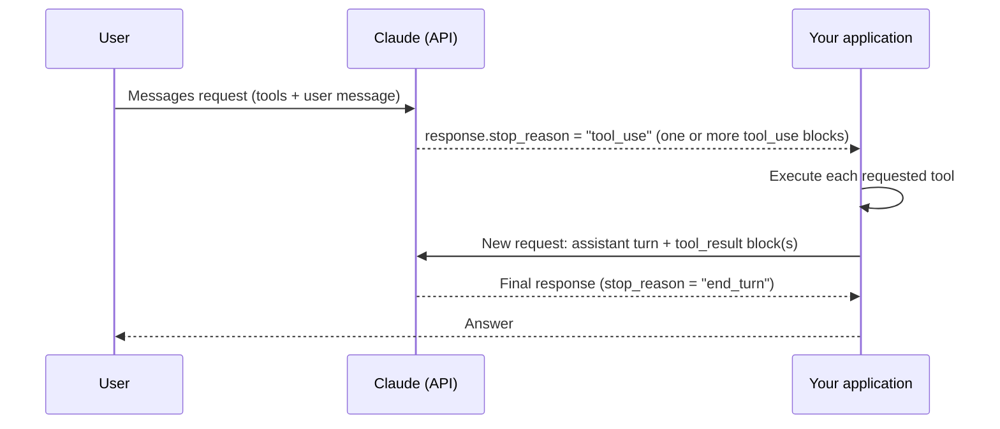
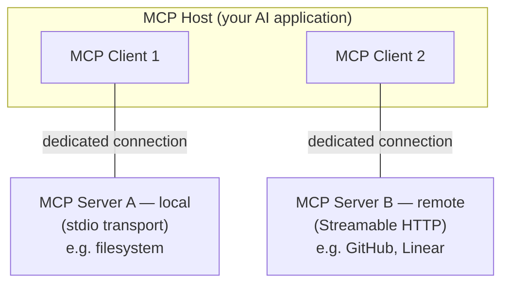

## Defining tools: the `tools` array

- Tool use lets Claude call functions **you** define or that Anthropic provides. You send a `tools` array on a Messages API request; Claude decides whether to emit a `tool_use` block asking your code (or Anthropic's infrastructure) to run one.
- **Client tools** (your own custom tools, plus Anthropic-schema tools like `bash` and `text_editor`) run in *your* application — Claude just returns the request, you execute it.
- **Server tools** (`web_search`, `web_fetch`, `code_execution`, `tool_search`, the MCP connector) run on Anthropic's infrastructure — you never write handler code for them.
- Each custom tool definition has three required fields:
  - `` `name` `` — matches `^[a-zA-Z0-9_-]{1,64}$`. Use clear, specific names (`get_stock_price`, not `stock`); namespace by service when you have many tools (`github_list_prs`, `slack_send_message`).
  - `` `description` `` — a plaintext explanation of what the tool does, when to use it (and when *not* to), and what each parameter means. **This is the single most important factor in tool-selection accuracy** — Claude reads it to decide whether and how to call the tool. Aim for 3–4+ sentences minimum; be prescriptive about *when* to call it, not just what it does.
  - `` `input_schema` `` — a {{JSON Schema|A standard, language-agnostic vocabulary for describing the shape and constraints of JSON data}} object describing the expected arguments.
- An optional `input_examples` array can show Claude concrete valid inputs — useful for complex, nested, or format-sensitive parameters.

> **Gotcha:** A vague description ("Gets the stock price for a ticker.") leaves Claude guessing about triggering conditions and parameter meaning. A good description explains what it does, when to use it, what it returns, and what it *doesn't* return.

```json
{
  "name": "get_weather",
  "description": "Get the current weather for a given location. Use this whenever the user asks about current or forecasted weather conditions for a specific place. Returns temperature, conditions, and wind — it does not return historical weather data.",
  "input_schema": {
    "type": "object",
    "properties": {
      "location": {
        "type": "string",
        "description": "City and state, e.g. San Francisco, CA"
      },
      "unit": {
        "type": "string",
        "enum": ["celsius", "fahrenheit"],
        "description": "Temperature unit"
      }
    },
    "required": ["location"]
  }
}
```

- `strict: true` on a tool definition (alongside `name`/`description`/`input_schema`) guarantees Claude's `input` always validates against your schema exactly — no missing fields, no type mismatches. Requires `additionalProperties: false` and a `required` list in the schema.
- **Consolidate related operations into fewer, broader tools** (one `manage_pr` tool with an `action` parameter beats separate `create_pr`/`review_pr`/`merge_pr` tools) — fewer tools with clearer boundaries reduce selection ambiguity.

> **Exam tip:** the three tool-definition fields tested by name are `name`, `description`, and `input_schema`. `input_schema` is standard JSON Schema — `type`, `properties`, `required`, `enum`, etc.

---

## `tool_choice`: controlling when and which tool is used

- `tool_choice` is a request-level parameter that constrains *whether* Claude calls a tool and *which* one.

| `tool_choice` value | Behavior |
|---|---|
| `{"type": "auto"}` | Claude decides whether to call any tool. **Default when `tools` is present.** |
| `{"type": "any"}` | Claude **must** call *some* tool, but you don't pick which one. |
| `{"type": "tool", "name": "..."}` | Claude **must** call the *named* tool. |
| `{"type": "none"}` | Claude cannot call any tool at all. **Default when `tools` is absent.** |

```json
{
  "model": "claude-opus-5",
  "max_tokens": 1024,
  "tools": [ /* ... */ ],
  "tool_choice": { "type": "tool", "name": "get_weather" },
  "messages": [{ "role": "user", "content": "What's the weather in Paris?" }]
}
```

- Add `"disable_parallel_tool_use": true` to *any* `tool_choice` value to force **at most one** tool call per turn (parallel tool use is otherwise on by default — see below).
- When `tool_choice` is `any` or `tool`, the API effectively prefills the assistant's response to force a tool call — Claude will **not** emit explanatory prose first, even if you ask it to. If you want natural-language commentary *and* a specific tool used, keep `tool_choice: {"type": "auto"}` and steer with an instruction in the user turn instead (e.g. *"Use the `get_weather` tool in your response."*).
- Changing `tool_choice` between requests invalidates the cached **message** blocks (tool definitions and system prompt stay cached).

> **Gotcha:** with **manual** extended thinking (`thinking: {type: "enabled"}`), only `auto` and `none` are supported for `tool_choice` — `any` and a named `tool` return an error. Adaptive thinking (`thinking: {type: "adaptive"}`), including on models where thinking is on by default, *does* support forced tool use.

> **Exam tip:** memorize the four literal `type` values — `auto`, `any`, `tool`, `none` — and that `tool` is the one that takes an extra `name` field to force a *specific* tool.

---

## Parallel vs. sequential tool execution, and error handling

### The full round trip



### A worked example: request, `tool_use`, `tool_result`

Continuing the `get_weather` tool and `tool_choice` request above, Claude's response carries the `tool_use` block your code must act on:

```json
{
  "id": "msg_01Aq9w938a90dw8q",
  "role": "assistant",
  "content": [
    { "type": "text", "text": "I'll check the current weather in Paris for you." },
    {
      "type": "tool_use",
      "id": "toolu_01A09q90qw90lq917835lq9",
      "name": "get_weather",
      "input": { "location": "Paris, France", "unit": "celsius" }
    }
  ],
  "stop_reason": "tool_use"
}
```

You execute `get_weather`, then send a new request with the *entire* history so far plus a `tool_result` for that `tool_use.id`:

```json
{
  "model": "claude-opus-5",
  "max_tokens": 1024,
  "tools": [ /* same tools array as the original request */ ],
  "messages": [
    { "role": "user", "content": "What's the weather in Paris?" },
    {
      "role": "assistant",
      "content": [
        { "type": "text", "text": "I'll check the current weather in Paris for you." },
        {
          "type": "tool_use",
          "id": "toolu_01A09q90qw90lq917835lq9",
          "name": "get_weather",
          "input": { "location": "Paris, France", "unit": "celsius" }
        }
      ]
    },
    {
      "role": "user",
      "content": [
        {
          "type": "tool_result",
          "tool_use_id": "toolu_01A09q90qw90lq917835lq9",
          "content": "18°C, partly cloudy, light wind from the west."
        }
      ]
    }
  ]
}
```

Claude replies to this second request with `stop_reason: "end_turn"` and a text answer built from the tool result — no further tool call needed.

> **In practice:** the Messages API is stateless — you resend the *entire* message history on every turn, including the assistant's own `tool_use` turn verbatim before your `tool_result` turn. Most SDKs (or the Tool Runner, below) accumulate this for you; the most common hand-rolled-loop bug is dropping the assistant turn and sending only the `tool_result`, which breaks the `tool_use`/`tool_result` pairing the API expects.

- In a single turn, Claude's response can contain **multiple `tool_use` blocks** — this is **parallel tool use**, and it is **on by default**. Execute them (concurrently, if independent) and return **all** results together.
- **Formatting rules that the exam loves to test:**
  - All `tool_result` blocks for one assistant turn go into a **single** `user` message — never split across multiple messages.
  - Within that `content` array, every `tool_result` block must come **before** any plain `text` block. Text before a `tool_result` triggers a 400 error.
  - `tool_result` blocks must immediately follow their matching `tool_use` blocks in message history — no other messages in between.
  - Each `tool_result` needs `tool_use_id` matching the original `tool_use.id`, plus `content` (string, or a list of `text`/`image`/`document`/`search_result` blocks) and an optional `is_error`.

> **Gotcha:** returning `tool_result` blocks split across multiple messages, or interleaving other content between a `tool_use` and its `tool_result`, silently trains the model toward *not* calling tools in parallel next time — and can trigger a 400 (`"tool_use ids were found without tool_result blocks immediately after"`).

### Error handling in `tool_result`

- When your tool itself fails (network error, bad input, timeout), return the result with `"is_error": true` and an **informative** message in `content` — not a bare `"failed"`. Claude uses that text to decide whether to retry, try something else, or explain the failure to the user.

```json
{
  "role": "user",
  "content": [
    {
      "type": "tool_result",
      "tool_use_id": "toolu_01A09q90qw90lq917835lq9",
      "content": "ConnectionError: weather service unavailable (HTTP 500). Retry after 60 seconds.",
      "is_error": true
    }
  ]
}
```

- **Invalid tool calls** (missing required params) are usually a sign the `description` needs more detail. You can also just return an error `tool_result` — Claude will typically retry 2–3 times with corrections before giving up and explaining to the user.
- **Server tool errors** (e.g. web search rate-limited) are handled transparently by Claude — you never see or set `is_error` for those; Claude gets the error and adapts on its own.
- `strict: true` on the tool definition eliminates the "invalid tool call" failure mode entirely by guaranteeing schema-valid input.

### Manual loop vs. Tool Runner

- **Manual agentic loop**: you write `while stop_reason == "tool_use": execute → send tool_result → repeat` yourself. Full control, no beta dependency.
- **Tool Runner** (SDK beta helper, `client.beta.messages.tool_runner`): the SDK drives the loop, executes your tool functions, and sends results back automatically — recommended default unless you need a control flow the runner's hooks don't cover.
- A response can also carry `stop_reason: "pause_turn"` when a **server-side** tool's internal loop hits its iteration limit — re-send the conversation as-is (don't add an extra "Continue" message) and the server resumes.

> **Exam tip:** "parallel tool execution" on the exam means *Claude requesting several tool calls in one turn*, not your code running them concurrently (though you may). The API-level requirement being tested is almost always "all `tool_result` blocks go in one `user` message, `tool_result` before `text`."

---

## Model Context Protocol (MCP) fundamentals

- {{MCP|Model Context Protocol: an open standard for connecting AI applications to external data sources, tools, and workflows}} is an open-source protocol for connecting AI applications to external systems — think of it as a standard connector so tools/data sources don't need a bespoke integration for every AI app.
- **Three participants**, always in this shape:
  - **MCP host** — the AI application (e.g. Claude Code, Claude Desktop, your own agent) that coordinates one or more MCP clients.
  - **MCP client** — a component, one per server connection, that the host creates to talk to a specific MCP server.
  - **MCP server** — the program that actually exposes tools/data/prompts. Can run locally or remotely.
- **What a server can expose** (the core primitives):
  - **Tools** — executable functions the AI can invoke (file ops, API calls, DB queries).
  - **Resources** — contextual data the AI can read (file contents, DB records, API responses).
  - **Prompts** — reusable interaction templates (system prompts, few-shot examples).
- **Transports** — how client and server actually talk:
  - **stdio** — standard input/output between two local processes on the same machine. No network overhead; typically one client per server.
  - **Streamable HTTP** — HTTP POST plus optional Server-Sent Events for streaming; used for remote servers, supports bearer tokens/API keys/OAuth, and can serve many clients at once.



> **Note:** MCP is a **data-layer protocol**, not an opinion about how you use the LLM — it only standardizes how context and actions move between an AI application and external systems.

### Connecting to MCP servers from the Messages API

- Anthropic's **MCP connector** lets you call tools on a **remote** MCP server directly from a Messages API request — no separate MCP client needed. It's a beta feature (header `mcp-client-2025-11-20`) and currently supports **tool calls only** (not resources or prompts), and the server must be reachable over HTTP — local stdio servers can't be connected this way.

```json
{
  "model": "claude-opus-5",
  "max_tokens": 1000,
  "mcp_servers": [
    {
      "type": "url",
      "url": "https://example-server.modelcontextprotocol.io/sse",
      "name": "example-mcp",
      "authorization_token": "YOUR_TOKEN"
    }
  ],
  "tools": [
    { "type": "mcp_toolset", "mcp_server_name": "example-mcp" }
  ],
  "messages": [{ "role": "user", "content": "What tools do you have available?" }]
}
```

- `mcp_servers` declares the connection (URL, name, optional OAuth `authorization_token`); `tools` needs a matching `mcp_toolset` entry (`mcp_server_name` must reference a server you declared) — every declared server must be referenced by exactly one toolset.
- Per-tool control lives on the toolset, not the server entry: `default_config` sets a baseline (`enabled`, `defer_loading`) applied to every tool from that server, and `configs` overrides individual tool names. Precedence, highest to lowest: tool-specific `configs` → set-level `default_config` → system default (`enabled: true`).

```json
{
  "type": "mcp_toolset",
  "mcp_server_name": "google-calendar-mcp",
  "default_config": { "enabled": false },
  "configs": {
    "search_events": { "enabled": true },
    "create_event": { "enabled": true }
  }
}
```

> **In practice:** `default_config.enabled: false` plus an explicit allowlist in `configs` is how you scope a shared or third-party MCP server down to only the tools this particular app should use, without asking the server owner to change anything. The inverse — leave everything enabled and set `enabled: false` on just the destructive tools (`delete_all_events`, `share_calendar_publicly`) — is the standard pattern for a read-mostly assistant you don't fully trust yet.

- When Claude calls a tool through the connector, execution happens **entirely on Anthropic's infrastructure** — you never construct or send a `tool_result`. The response instead carries two connector-specific block types that report what already happened:

```json
{
  "type": "mcp_tool_use",
  "id": "mcptoolu_014Q35RayjACSWkSj4X2yov1",
  "name": "echo",
  "server_name": "example-mcp",
  "input": { "param1": "value1", "param2": "value2" }
}
```

```json
{
  "type": "mcp_tool_result",
  "tool_use_id": "mcptoolu_014Q35RayjACSWkSj4X2yov1",
  "is_error": false,
  "content": [{ "type": "text", "text": "Hello" }]
}
```

> **Exam tip:** don't confuse `mcp_tool_use`/`mcp_tool_result` (MCP connector, server-executed, informational only) with `tool_use`/`tool_result` (client tools, where *you* execute the call and must send a `tool_result` back). If Claude used the connector, your code has nothing to execute — the block pair is just a record of what Anthropic's infrastructure already did.

- If you need **resources or prompts**, or a **local/stdio** server, you build (or use) a real MCP client — the Anthropic SDKs ship helper functions (`mcp_tools`/`async_mcp_tool`, `mcp_message`/`mcp_messages`, `mcp_resource_to_content`, `mcp_resource_to_file`) to convert between MCP types and Claude API types when you drive your own MCP client alongside the Anthropic SDK, typically feeding the result into `client.beta.messages.tool_runner`.

### Building a minimal MCP server

```bash
# Requires Python 3.10+ and the mcp package (SDK 2.0+)
uv add "mcp[cli]"
# or: pip install "mcp[cli]"
```

```python
from typing import Any

import httpx
from mcp.server import MCPServer

mcp = MCPServer("weather")

NWS_API_BASE = "https://api.weather.gov"
USER_AGENT = "weather-app/1.0"


async def make_nws_request(url: str) -> dict[str, Any] | None:
    """Make a request to the NWS API with proper error handling."""
    headers = {"User-Agent": USER_AGENT, "Accept": "application/geo+json"}
    async with httpx.AsyncClient() as client:
        try:
            response = await client.get(url, headers=headers, timeout=30.0)
            response.raise_for_status()
            return response.json()
        except Exception:
            return None


@mcp.tool()
async def get_forecast(latitude: float, longitude: float) -> str:
    """Get weather forecast for a location.

    Args:
        latitude: Latitude of the location
        longitude: Longitude of the location
    """
    points_url = f"{NWS_API_BASE}/points/{latitude},{longitude}"
    points_data = await make_nws_request(points_url)
    if not points_data:
        return "Unable to fetch forecast data for this location."

    forecast_url = points_data["properties"]["forecast"]
    forecast_data = await make_nws_request(forecast_url)
    if not forecast_data:
        return "Unable to fetch detailed forecast."

    period = forecast_data["properties"]["periods"][0]
    return f"{period['name']}: {period['detailedForecast']}"


if __name__ == "__main__":
    mcp.run(transport="stdio")
```

- The `@mcp.tool()` decorator turns the function's **type hints** into `input_schema` and its **docstring** (including the `Args:` section) into `description` and per-argument help — no manual JSON Schema, no request parsing.
- `MCPServer` is the SDK's current top-level class. Older tutorials and blog posts commonly show `from mcp.server.fastmcp import FastMCP` instead — that's the SDK's earlier name for the same thing (`FastMCP` → `MCPServer`), kept as an alias for backward compatibility.
- Run it directly with `uv run weather.py` (or `python weather.py`), or launch it straight into the Inspector for interactive testing with `uv run mcp dev weather.py` — see *Testing and debugging* below.

> **Gotcha:** on a `stdio` server, anything written to stdout — including a stray `print()` — corrupts the JSON-RPC message stream and breaks the connection. Use the standard `logging` module (writes to stderr) for any diagnostic output; HTTP-based servers don't have this restriction.

> **Note:** MCP has official SDKs for several languages (TypeScript, Java, Kotlin, C#, Ruby, besides Python) — same protocol, different syntax. These notes stick to Python throughout.

- Deploying/connecting: a host (Claude Desktop, Claude Code, your own agent) is configured with a **command to launch your server** (for stdio) or a **URL** (for Streamable HTTP); it spins up an MCP client that performs capability discovery, then lists and calls your tools as needed.

### Registering a server with a host

A server is inert until a host knows how to launch or reach it. The config shape is consistent across hosts — a server name, a launch command, and optional environment variables.

**Claude Desktop** reads `claude_desktop_config.json` (macOS: `~/Library/Application Support/Claude/claude_desktop_config.json`; Windows: `%AppData%\Claude\claude_desktop_config.json`):

```json
{
  "mcpServers": {
    "weather": {
      "command": "uv",
      "args": ["--directory", "/ABSOLUTE/PATH/TO/PARENT/FOLDER/weather", "run", "weather.py"]
    }
  }
}
```

**Claude Code** reads the same `mcpServers` shape from a project's `.mcp.json` (check it into version control to share with your team), or you can skip hand-editing JSON with the CLI:

```bash
# Local stdio server — everything after -- is passed to the server untouched
claude mcp add --env AIRTABLE_API_KEY=YOUR_KEY --transport stdio airtable -- npx -y airtable-mcp-server

# Remote HTTP server
claude mcp add --transport http notion https://mcp.notion.com/mcp

# List configured servers and their live connection status
claude mcp list
```

The resulting `.mcp.json`:

```json
{
  "mcpServers": {
    "airtable": {
      "command": "npx",
      "args": ["-y", "airtable-mcp-server"],
      "env": { "AIRTABLE_API_KEY": "YOUR_KEY" }
    }
  }
}
```

- An entry with a `url` and no `type` is a configuration error — Claude Code reads **no `type`** as **stdio**, so an HTTP entry needs `"type": "http"` (or `"sse"` / `"ws"`) explicitly.
- `.mcp.json` supports `${VAR}` and `${VAR:-default}` expansion inside `command`, `args`, `env`, `url`, and `headers`, so a team can share the file without committing secrets.
- Claude Code prompts for approval before using a project-scoped `.mcp.json` server the first time; local- and user-scoped servers (`claude mcp add --scope local|user`) skip that prompt but are private to you.

> **In practice:** the single most common "my MCP server won't connect" bug is a relative path in `command`/`args` — the host launches your server from its own working directory, not your project's. Use absolute paths (Claude Code also sets `CLAUDE_PROJECT_DIR` in the spawned server's environment, so `process.env.CLAUDE_PROJECT_DIR` / `os.environ["CLAUDE_PROJECT_DIR"]` is a portable alternative), and restart the host after editing its config — neither Claude Desktop nor Claude Code hot-reloads `claude_desktop_config.json` / `.mcp.json` on save.

### Testing and debugging: the MCP Inspector

The [MCP Inspector](https://modelcontextprotocol.io/docs/tools/inspector) (`@modelcontextprotocol/inspector`) is the reference tool for exercising a server before wiring it into a full host. One package, three interfaces, all built on `npx` — no install step:

```bash
# Web UI (default) — launches your server and opens a browser
npx @modelcontextprotocol/inspector node path/to/server/index.js

# CLI — scriptable, for shells and CI
npx @modelcontextprotocol/inspector --cli node path/to/server/index.js --method tools/list

# TUI — interactive, terminal-only
npx @modelcontextprotocol/inspector --tui node path/to/server/index.js
```

- Point it at any launch command, not just Node — e.g. `npx @modelcontextprotocol/inspector uvx mcp-server-git --repository ~/code/myrepo` for a Python/`uvx`-launched server, or `--server-url https://... --transport http` for a remote server.
- The Python SDK wraps the same tool: `uv run mcp dev weather.py` (from the `mcp[cli]` extra) launches your `MCPServer` script straight into the Inspector — no separate `npx` invocation needed.
- For the MCP **connector** (remote, OAuth-authenticated servers called from the Messages API), the Inspector's "Quick OAuth Flow" is also the documented way to mint a test `access_token` to drop into `authorization_token` before you've built real OAuth handling in your app.

> **Exam tip:** the Inspector is a *development/debugging* tool, not part of the MCP protocol itself, and not something an exam scenario would frame as required production infrastructure — know what problem it solves (inspect tools/resources/prompts, replay calls, mint a test OAuth token) rather than its flags.

---

## Choosing: built-in tools vs. custom tools vs. Skills vs. MCP

| Option | What it is | Reach for it when |
|---|---|---|
| **Built-in (server) tools** | Anthropic-hosted tools you just declare in `tools` — `web_search`, `web_fetch`, `code_execution`, `tool_search`, `computer_use` (self- or Anthropic-hosted), plus Anthropic-*schema* client tools `bash`, `text_editor`, `memory` | The capability is generic and Anthropic already built it well — web search/fetch, sandboxed code execution, GUI/computer control, file/shell operations. Zero or minimal integration code. |
| **Custom tools** | You write `name`/`description`/`input_schema` and the handler code in your app | The action is specific to *your* system — your database, your internal API, your business logic. You own execution and can gate/audit/rate-limit it. |
| **Skills** | A packaged folder (`SKILL.md` + optional scripts/resources) of instructions and know-how that Claude loads *progressively* — metadata always in context, full instructions only when triggered | You want to give Claude *procedural knowledge* — house style, a multi-step workflow, domain expertise — reusable across many conversations, without paying full context cost every turn. Complements tools; it's knowledge, not an action. |
| **MCP (server / connector)** | An external, standardized server exposing tools/resources/prompts over stdio or HTTP, usable from many different AI applications, not just your one codebase | You need to connect to **third-party or shared infrastructure** (GitHub, Slack, a company-wide data source) or want one integration reusable across multiple apps/agents instead of hand-rolling a custom tool per app. |

- **Built-in vs. custom**: ask "did Anthropic already solve this generic problem?" — search, fetch, sandboxed execution, computer control. If yes, use the built-in tool; you skip writing and hosting the execution logic.
- **Custom tool vs. MCP server**: a custom tool is the right choice when only *your* application needs the action. Once **multiple applications or teams** need the same integration (e.g. "talk to our ticketing system"), pulling it out into an MCP server means you write the integration once and any MCP-compatible host can use it — this is the main reason MCP exists.
- **Skills vs. tools**: a tool is an *action* (a function Claude can call); a Skill is *knowledge* (instructions Claude reads and follows, often orchestrating several tool calls along the way). Skills and tools are complementary, not competitors — a Skill's instructions frequently tell Claude which tools to use and how.
- **Skills vs. MCP**: a Skill packages instructions that live in *your* environment (or ship with the model surface, e.g. Claude Code); an MCP server exposes *capabilities* over a network protocol that any compliant client can consume. If the goal is "share this integration across totally different applications," that's MCP; if it's "teach Claude how to do this specific task well," that's a Skill.

> **Exam tip:** the blueprint phrase is "choosing built-in tools vs. custom tools vs. Skills vs. MCP" — expect a scenario question ("your team wants every internal agent, regardless of framework, to be able to query the same internal wiki — what do you build?") where the answer is MCP specifically *because* of reuse across independent applications, not because of any technical capability a custom tool couldn't also provide.

### Further reading

- [Tool use overview](https://platform.claude.com/docs/en/agents-and-tools/tool-use/overview) — tool definitions, client vs. server tools, pricing
- [Define tools](https://platform.claude.com/docs/en/agents-and-tools/tool-use/define-tools) — `tool_choice` modes, best practices for descriptions, forcing tool use
- [Handle tool calls](https://platform.claude.com/docs/en/agents-and-tools/tool-use/handle-tool-calls) — `tool_result` formatting rules and `is_error` error handling
- [MCP connector](https://platform.claude.com/docs/en/agents-and-tools/mcp-connector) — calling remote MCP servers directly from the Messages API, `mcp_toolset` config, client-side helpers
- [Model Context Protocol — architecture overview](https://modelcontextprotocol.io/docs/2026-07-28/learn/architecture) — hosts/clients/servers, primitives, transports
- [Build an MCP server](https://modelcontextprotocol.io/docs/2026-07-28/develop/build-server) — official step-by-step server tutorial (Python, TypeScript, Java, Kotlin, C#, Ruby)
- [MCP Inspector](https://modelcontextprotocol.io/docs/tools/inspector) — testing and debugging MCP servers, web/CLI/TUI clients
- [Connect Claude Code to tools via MCP](https://code.claude.com/docs/en/mcp) — `.mcp.json`, `claude mcp add`, installation scopes, OAuth
- [Agent Skills overview](https://platform.claude.com/docs/en/agents-and-tools/agent-skills/overview) — SKILL.md format and progressive disclosure
