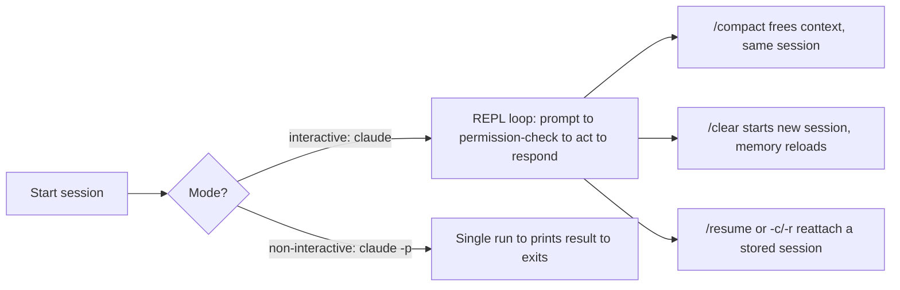
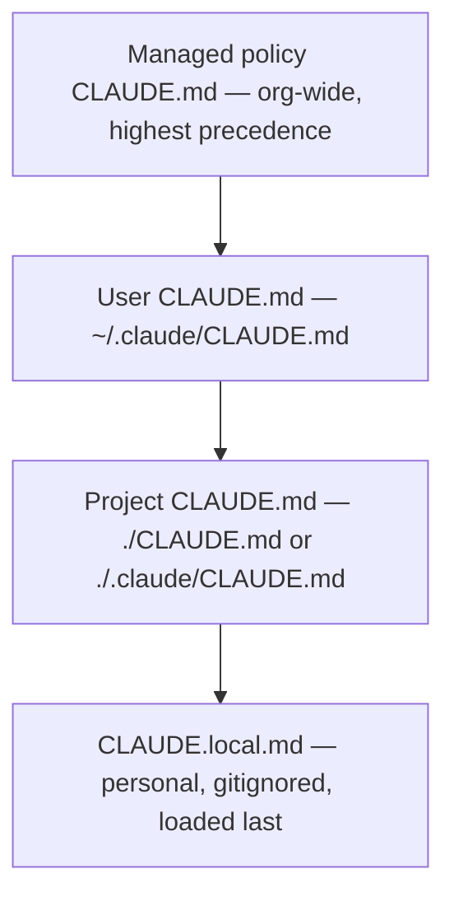

## Claude Code fundamentals

> **Exam tip:** the exam weights this domain small (3.1%, ~2 questions), but questions tend to be precise about *exact file names* and *exact precedence order* — memorize those over vague concepts.

- **Claude Code** is Anthropic's **agentic coding tool**: it reads your codebase, edits files, runs shell commands, and drives git — not just autocomplete-style suggestions inside an editor.
- Ships as a full-featured **terminal CLI** (`claude`), plus surfaces that share the same underlying engine: **VS Code** / **JetBrains** IDE extensions, a **desktop app**, and a **web** version at `claude.ai/code`. `CLAUDE.md` files, settings, and MCP servers work identically across all of them.
- {{agentic coding|Claude plans an approach, takes multiple actions (read, edit, run, test) across turns, and verifies its own work — as opposed to a single-shot autocomplete suggestion a human must apply and check.}} is the key differentiator from traditional "coding assistant" tools: Claude Code is *proactive* — it can execute a task end-to-end (e.g. "write tests for the auth module, run them, and fix failures") rather than just proposing a diff.
- Core capabilities to remember:
  - Reads and edits files directly in your project.
  - Runs terminal commands (build, test, lint, install packages).
  - Works with **git**: stages changes, writes commit messages, creates branches, opens PRs.
  - Connects to external tools via **MCP** (Model Context Protocol) — e.g. Jira, Slack, Google Drive.
  - Composable/scriptable — follows the **Unix philosophy**: you can pipe data into it and chain it with other CLI tools.
- Integrates into a **broader dev workflow**, not just ad-hoc chat:
  - **CI/CD**: GitHub Actions, GitLab CI/CD — automate PR review and issue triage.
  - **Code review**: automatic review on every PR.
  - **Scheduling**: recurring tasks (`/schedule`, Routines, `/loop`) for jobs like morning PR reviews or dependency audits.
  - **Chat ops**: mention `@Claude` in Slack to route a bug report into a PR.

```bash
# One-off task from the shell
claude "write tests for the auth module, run them, and fix any failures"

# Works with Unix pipes
tail -200 app.log | claude -p "Slack me if you see any anomalies"
```

## Interaction modes & session management

- **Interactive mode** (default): run `claude` (optionally with an initial prompt) to start a persistent, conversational **REPL**-like session — real-time back-and-forth, permission prompts appear as Claude wants to act, and you can steer mid-task.
- **Non-interactive / print mode** (`-p` / `--print`): `claude -p "query"` runs once, prints the result, and exits — built for **automation, CI/CD, and scripting**. Accepts piped stdin (`cat file | claude -p "..."`).
  - `--output-format` controls machine-readable output: `text` (default), `json` (structured), `stream-json` (streaming events) — essential for parsing Claude Code's output in a pipeline.
  - Scripting flags worth knowing: `--max-turns` (cap agentic turns), `--max-budget-usd` (spending cap), `--dangerously-skip-permissions` (skip prompts — use with care), `--permission-mode`.
- **Session persistence & resuming** — sessions are stored locally and are searchable across projects/worktrees on your machine:

| Flag | Purpose |
| --- | --- |
| `--continue` / `-c` | Resume the most recent conversation in the current directory |
| `--resume` / `-r` | Resume a specific session by ID or name (interactive picker if none given) |
| `--session-id` | Pin a session to a specific UUID |
| `--fork-session` | Branch off a new session ID while resuming, preserving history |
| `--name` / `-n` | Give the session a display name |

- In-session slash commands for session/context management:
  - `` `/resume` `` — return to an earlier conversation.
  - `` `/clear` `` (aliases `/reset`, `/new`) — start fresh **but keep project memory** (`CLAUDE.md` still loads).
  - `` `/compact [instructions]` `` — summarize the conversation to free context **while continuing the same session** (preserves rules, skills, memory files).
  - `` `/context` `` — visualize current context-window usage; also the way to confirm which memory files actually loaded.
  - `` `/fork [prompt]` ``, `` `/branch [name]` `` — copy or branch a conversation to try an alternate direction.

> **Gotcha:** `/clear` and `/compact` are *not* the same. `/clear` wipes context and starts a new conversation (project memory reloads fresh). `/compact` shrinks the *current* conversation's context via summarization without ending it.

- Every session starts with a **fresh context window**; two mechanisms carry knowledge forward across sessions: `CLAUDE.md` files (instructions *you* write) and **auto memory** (notes *Claude* writes itself about your corrections/preferences, stored under `~/.claude/projects/<project>/memory/`).
- After `/compact`, the **project-root `CLAUDE.md` survives** — Claude re-reads it from disk and re-injects it. Nested `CLAUDE.md` files and path-scoped rules are *not* auto re-injected; they reload only when Claude next touches a matching file.



## CLAUDE.md configuration hierarchy

- `` `CLAUDE.md` `` is a plain markdown file Claude Code **automatically reads at the start of every session** to get persistent project context: build/test commands, coding standards, architecture notes, conventions.
- Claude Code reads `CLAUDE.md`, **not** `AGENTS.md`. If a repo already has `AGENTS.md` for other tools, create a `CLAUDE.md` that does `@AGENTS.md` (import syntax) so both stay in sync, or symlink it.
- Run `` `/init` `` to auto-generate a starting `CLAUDE.md` from the codebase; it suggests improvements rather than overwriting an existing one. Run `` `/memory` `` to view/edit all memory files in a session, and `` `/context` `` to confirm what actually loaded.

> **Exam tip:** know the **precedence/load order**, broadest scope to narrowest — a project instruction is read *after* (and thus can refine) a user instruction, because all files are concatenated into context rather than one overriding another.

| Scope | Location | Purpose | Shared with |
| --- | --- | --- | --- |
| **Managed / enterprise policy** | macOS `/Library/Application Support/ClaudeCode/CLAUDE.md`; Linux/WSL `/etc/claude-code/CLAUDE.md`; Windows `C:\Program Files\ClaudeCode\CLAUDE.md` | Org-wide instructions from IT/DevOps (compliance, security policy) — cannot be excluded by individual settings | All users in the org |
| **User instructions** | `~/.claude/CLAUDE.md` | Personal preferences across all projects | Just you |
| **Project instructions** | `./CLAUDE.md` or `./.claude/CLAUDE.md` | Team-shared architecture/standards, checked into version control | Team via source control |
| **Local instructions** | `./CLAUDE.local.md` | Personal, project-specific preferences (sandbox URLs, test data) — add to `.gitignore` | Just you, this project |

- **All discovered files are concatenated into context — later files don't override earlier ones**, they're read in addition. Claude Code walks up the directory tree from your working directory, loading every `CLAUDE.md`/`CLAUDE.local.md` it finds; content is ordered **root-first**, so the file closest to where you launched Claude is read *last* (and `CLAUDE.local.md` is appended right after its sibling `CLAUDE.md`).
- Nested `CLAUDE.md` files in **subdirectories below** your working directory are *not* loaded at launch — they load on demand only when Claude reads a file in that subdirectory.
- Files can **import** other files with `` `@path/to/file` `` syntax (relative or absolute); imports can recurse up to **4 hops deep**. Wrap a path in backticks (`` `@README` ``) to mention it literally without importing.
- **Size matters for adherence**: target **under 200 lines** per `CLAUDE.md` — CLAUDE.md content is delivered as a user message (not the system prompt), so it's context, not hard enforcement, and longer files reduce how reliably Claude follows them.
- For larger projects, split instructions into `` `.claude/rules/*.md` `` — see the Rules row in the table below. Rules can be scoped with `paths:` frontmatter (glob patterns) so they only load when Claude touches matching files.
- Use `claudeMdExcludes` (any settings layer) in monorepos to skip irrelevant ancestor `CLAUDE.md` files from other teams.



> **Gotcha:** "highest precedence" here means loaded *first* / broadest scope — not "wins a conflict and hides the rest." Since files are concatenated rather than overridden, contradictory instructions across files can make Claude pick one **arbitrarily**; keep instructions consistent and review periodically.

## Rules, Skills, Commands, and (Sub)Agents

- These four mechanisms are how you extend and customize Claude Code beyond plain conversation. They differ mainly in **when their content loads** and **who can trigger them**.

| Mechanism | Purpose | File location | How invoked / loaded |
| --- | --- | --- | --- |
| **Rules** | Modular, topic-specific instructions split out of a growing `CLAUDE.md` (e.g. `testing.md`, `security.md`); can be scoped to file paths | `.claude/rules/*.md` (project), `~/.claude/rules/` (user) | Loaded at session start (same priority as `CLAUDE.md`) *unless* they carry `paths:` frontmatter — then they load only when Claude opens a matching file |
| **Skills** | Package a repeatable, reusable procedure/workflow/checklist (what used to be "custom commands") so it doesn't bloat `CLAUDE.md` | `.claude/skills/<name>/SKILL.md` (project), `~/.claude/skills/<name>/SKILL.md` (personal), or a plugin's `skills/` dir | Claude can auto-invoke when relevant (its `description` decides), or you invoke directly with `` `/skill-name` `` |
| **Commands** | The original "type `/name`" mechanism; now merged into Skills — a file at `.claude/commands/deploy.md` behaves like a skill and creates `/deploy` | `.claude/commands/*.md` (project), `~/.claude/commands/` (personal) | Typed at the start of a message: `/command arg1 arg2`; only recognized as the first token of a message |
| **(Sub)Agents** | Specialized assistants with their **own context window**, system prompt, and restricted tool access — used for side tasks that would otherwise flood the main conversation (e.g. large search results, log dumps) | `.claude/agents/*.md` (project), `~/.claude/agents/` (user), or a plugin's `agents/` dir | Automatic delegation (Claude matches task to a subagent's `description`), explicit `@-mention`, or run the whole session as that agent via `--agent <name>` |

- **Skill/command frontmatter knobs worth remembering**:
  - `` `disable-model-invocation: true` `` — only *you* can trigger it (good for side-effecting actions like `/deploy`, `/commit`); Claude won't run it on its own.
  - `` `user-invocable: false` `` — only *Claude* can trigger it; hidden from the `/` menu (good for background reference knowledge).
  - `` `allowed-tools` `` — pre-approves specific tools for the turn that invokes the skill, so Claude doesn't prompt for permission.
  - `` `context: fork` `` — runs the skill in an isolated **subagent** context (its own conversation history) rather than inline.
- **Subagent frontmatter knobs worth remembering**: `name` and `description` are required; `tools` / `disallowedTools` restrict capability; `model` picks a (often cheaper/faster) model like `haiku`; `permissionMode` controls prompt behavior (`default`, `acceptEdits`, `plan`, `bypassPermissions`, etc.).
- **Built-in subagents** ship out of the box: **Explore** (fast, read-only codebase search), **Plan** (research during plan mode), **general-purpose** (multi-step research + edits). Explore and Plan intentionally skip loading `CLAUDE.md` and git status to stay fast/cheap.
- **Precedence when names collide is *not* the same order for every mechanism** — a common exam trap:
  - **Skills**: enterprise overrides personal, and personal overrides project (`~/.claude/skills/` beats `.claude/skills/`). Any of those overrides a same-named bundled skill. Plugin skills use a `plugin:skill` namespace so they never collide.
  - **Subagents**: managed settings > `--agents` CLI flag > project `.claude/agents/` > personal `~/.claude/agents/` > plugin — here **project beats personal**, the opposite ordering from skills.

> **Gotcha:** skills resolve personal-before-project, subagents resolve project-before-personal. Don't assume one ordering applies to both.

> **Note:** Claude Code also supports **Hooks** — shell commands that fire deterministically at fixed lifecycle events (e.g. `PreToolUse`, `PostToolUse`, auto-formatting after every edit, blocking a disallowed Bash command). Unlike `CLAUDE.md`/Rules/Skills (which are *context* Claude may or may not follow), hooks are **enforced regardless of what Claude decides** — this is the tool to reach for when an instruction like "always run the linter before commit" absolutely must happen.

> **Exam tip:** if a question asks "how do I guarantee X always happens" (not just "ask nicely"), the answer is a **hook**, not a `CLAUDE.md` instruction — CLAUDE.md/Rules/Skills only shape behavior, they don't enforce it.

### Further reading

- [Claude Code overview](https://code.claude.com/docs/en/overview) — what Claude Code is, install methods, surfaces, and workflow integrations.
- [How Claude remembers your project](https://code.claude.com/docs/en/memory) — full `CLAUDE.md` hierarchy, `.claude/rules/`, imports, and auto memory.
- [Extend Claude with skills](https://code.claude.com/docs/en/skills) — SKILL.md structure, frontmatter reference, invocation control.
- [Create custom subagents](https://code.claude.com/docs/en/sub-agents) — subagent scope, frontmatter fields, tool/permission restriction.
- [Slash commands reference](https://code.claude.com/docs/en/commands) — built-in commands, session management commands, custom command authoring.
- [CLI reference](https://code.claude.com/docs/en/cli-reference) — interactive vs. print mode, session flags, output formats, scripting flags.
