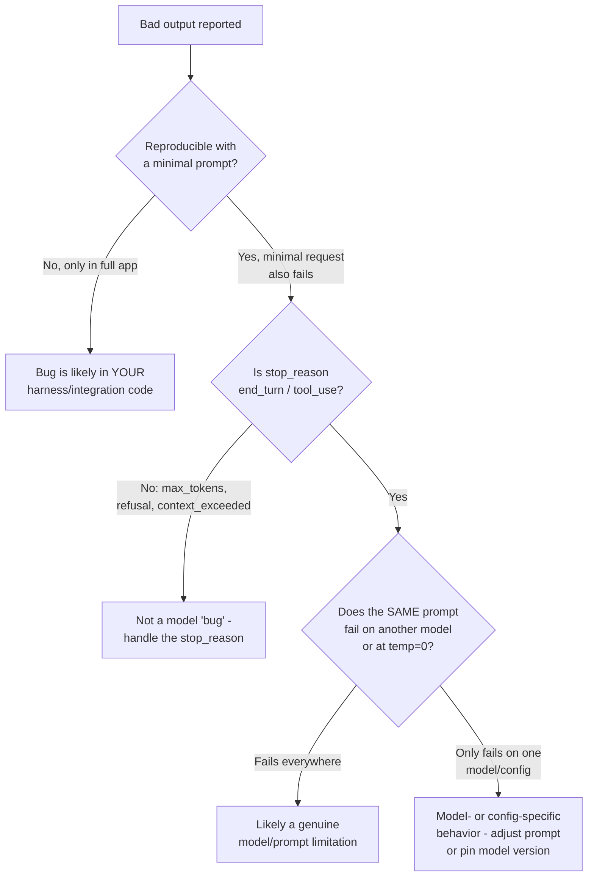
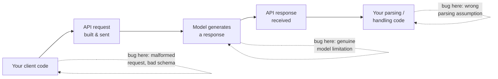

## Systematic evaluation of outputs

> **Exam tip:** This domain is only ~2.6% of the exam (1-2 questions) but tests a distinct mindset: *"it seems to work when I tried it a few times"* is not evidence. The exam wants you to recognize what a rigorous, repeatable evaluation process looks like.

- **Why "it seems to work" isn't enough:**
  - A handful of manual tries only samples the *easy*, obvious inputs you thought of — it says nothing about edge cases, adversarial inputs, or the long tail of real user behavior.
  - Without a fixed, repeatable test set, you can't tell whether a prompt change, model upgrade, or temperature tweak made things *better* or *worse* — you're comparing vibes, not numbers.
  - Manual spot-checking doesn't scale and doesn't catch **regressions** — a change that fixes one case can silently break three others.

### Building an {{eval set|A curated collection of representative test cases (inputs + expected/graded outputs) used to measure model or pipeline performance consistently over time}}

- **Mirror the real task distribution.** Pull examples from actual production traffic, support tickets, or realistic simulated inputs — not just cases you find interesting to write.
- **Deliberately include edge cases:**
  - Empty, malformed, or missing input data
  - Overly long inputs (near context-window limits)
  - Ambiguous cases where even human graders would disagree
  - Adversarial or harmful input
- **Prioritize volume over hand-crafted perfection.** Many automatically-graded test cases beat a small number of beautifully hand-graded ones — volume gives you statistical confidence and catches rarer failure modes.
- **Use a held-out set.** Don't reuse the same examples you used to iterate on the prompt — that's optimizing for the test, not the task (overfitting to your own eval set).
- Define **success criteria** up front, and make them *specific* and *measurable*:

| Vague (bad) | Specific (good) |
|---|---|
| "Safe outputs" | "Fewer than 0.1% of outputs flagged for toxicity, out of 10,000 trials" |
| "Good summaries" | "ROUGE-L F1 ≥ 0.4 against reference summaries" |
| "Fast enough" | "95th percentile latency < 2s" |

- Common dimensions worth scoring separately: **task fidelity**, consistency, relevance/coherence, tone/style, privacy preservation, context utilization, latency, and cost. Most real applications need a *multidimensional* rubric, not a single pass/fail number.

### Grading approaches

> **Exam tip:** Expect a question asking you to pick the *right grader* for a given output type (e.g., "classification label" → exact match; "empathetic tone" → LLM judge).

| Approach | Best for | Pros | Cons |
|---|---|---|---|
| **Code-based / exact-match** | Categorical or structured outputs (labels, JSON fields, numbers) | Cheap, deterministic, instant, no grader bias | Can't judge nuance, tone, or open-ended quality |
| **{{LLM-as-judge|Using a separate LLM call to score or grade another model's output against a rubric}}** | Subjective qualities: tone, helpfulness, safety, faithfulness | Scales to open-ended output, can apply nuanced rubrics | Costs tokens/latency, can be inconsistent, needs its own validation |
| **Human review** | High-stakes, ambiguous, or novel cases; validating the other two | Gold-standard judgment, catches what automated graders miss | Slow, expensive, doesn't scale, still subject to inter-rater disagreement |

- **Code-based / exact-match graders** — simplest and cheapest; compare model output to a known-correct answer.

```python
def evaluate_exact_match(model_output, correct_answer):
    return model_output.strip().lower() == correct_answer.strip().lower()

accuracy = sum(
    evaluate_exact_match(get_completion(tweet), tweet["sentiment"])
    for tweet in test_tweets
) / len(test_tweets)
```

- Other code-based techniques: **cosine similarity** on embeddings (semantic consistency across paraphrases), **ROUGE-L** (summarization/content overlap).
- **LLM-as-judge graders** — ask a separate model call to score the output against a rubric. Typical patterns: binary (yes/no — e.g. "does this contain PHI?"), Likert scale (1-5 — e.g. tone/empathy), or ordinal (context utilization).

```python
def evaluate_likert(model_output, target_tone):
    prompt = f"""Rate this response 1-5 for being {target_tone}:
    <response>{model_output}</response>
    1: Not at all {target_tone}
    5: Perfectly {target_tone}
    Output only the number."""
    response = client.messages.create(
        model="claude-opus-5", max_tokens=50,
        messages=[{"role": "user", "content": prompt}],
    )
    return int(response.content[0].text.strip())
```

> **Gotcha:** Prefer using a **different model** for grading than the one that generated the output — grading with the same model instance risks self-serving bias (a model rating its own work favorably). Encouraging the judge model to reason/think before outputting a score also measurably improves grading accuracy on complex judgments.

- **Human review** — the gold standard, but slow and expensive. Reserve it for: validating that your automated graders actually agree with human judgment, spot-checking a sample of automated grades, and genuinely ambiguous or high-stakes cases (legal, medical, safety-critical).

> **Exam tip:** A common exam pattern is "which grading method is cheapest and most reliable for X" — categorical/structured output → code-based; open-ended subjective quality → LLM-as-judge; final sign-off on high-stakes edge cases → human review. In practice, real pipelines usually combine all three.

### Tracking eval results over prompt/model changes

- Treat your eval set as a **regression suite**: rerun it every time you change the prompt, switch models, adjust temperature, or update tool definitions.
- Version your prompts and record the eval score alongside each version so you can trace *which change* caused a quality shift.
- Compare **side-by-side**, not just before/after in isolation — run the old and new prompt against the identical test set in the same pass so nothing else (like time-of-day API variance) confounds the comparison.
- Track scores broken down **per dimension** (accuracy, tone, latency, cost) rather than one aggregate number — a prompt tweak might raise accuracy while quietly hurting latency or tone.

> **Note:** The Anthropic Console ships a built-in **Evaluation tool** (the "Evaluate" tab) for exactly this: it runs a prompt against a set of test cases, grades on a scale, and supports side-by-side comparison as you iterate on prompt versions.

---

## Debugging techniques

- **Reproduce with a minimal prompt.** Before debugging a complex agent or multi-turn pipeline, strip the problem down to the smallest single request that still reproduces the bad output. This isolates whether the issue is in your surrounding harness or in the model's response to a specific input.
  - Remove tools, system prompt additions, and conversation history one at a time until the bug disappears — the last thing you removed is a strong suspect.
- **Inspect the full request and response, not just the final text.** Bugs often hide in parts of the payload your UI doesn't surface:
  - The exact `system` prompt and `messages` array as actually sent (not what you *think* you sent — log the serialized JSON)
  - Every **tool-use turn**: the `tool_use` block Claude emitted (name + input), and the `tool_result` you sent back, including `is_error`
  - `stop_reason` and `stop_details` on the response
  - `thinking` blocks, if extended/adaptive thinking is enabled

```python
response = client.messages.create(model="claude-opus-5", max_tokens=4096,
                                   messages=messages, tools=tools)
print("stop_reason:", response.stop_reason)
print("usage:", response.usage)
for block in response.content:
    print(block.type, "->", block)
```

- **Check token usage and truncation.** A truncated response can look like a "wrong" or "incomplete" answer when it's actually just cut off.
  - `stop_reason == "max_tokens"` — hit your requested output cap; raise `max_tokens` or continue the response.
  - `stop_reason == "model_context_window_exceeded"` — filled the model's *context window*, not just your token cap; the response is valid but limited — compact or shorten the conversation.
  - `stop_reason == "refusal"` — the model (or a safety classifier) declined; inspect `stop_details.category` before assuming a generic failure.

  > **Gotcha:** Stop reasons like `max_tokens` and `refusal` are **not HTTP errors** — you get a normal `200 OK`. If your code only checks for exceptions, a silently truncated or refused response will sail through unnoticed. Always inspect `stop_reason` explicitly.

- **Compare across model versions.** When behavior looks wrong, run the *identical* request against a different model (or model version) to see whether the issue is model-specific (a capability gap, a known behavioral quirk) or present everywhere (more likely your prompt/schema).
- **Use `temperature=0` (or low `effort`) for determinism when debugging.** Sampling randomness makes a bug look intermittent when it's really deterministic-but-rare, or vice versa.

  > **Note:** `temperature=0` narrows variance but does **not guarantee byte-identical output** across repeated calls — treat it as "more reproducible for diagnosis," not a perfect determinism switch. On newer model families sampling parameters like `temperature` may not even be configurable — control variance via `effort` and prompt specificity instead.

- **Streaming-specific debugging:** if you stream responses, `stop_reason` only appears on the `message_delta` event, not `message_start` — code that reads it too early will always see it as unset/`None`.



---

## Isolating failures between integration layers & recovery strategies

> **Exam tip:** Expect a scenario question like "the output looks wrong — where do you look first?" The correct instinct is **layer-by-layer isolation**, working from your code outward to the model, rather than guessing.

### Is the bug in YOUR code or in the MODEL's output?

- **Client-side code bugs** (the most common culprit in practice):
  - A malformed **tool schema** — a missing `required` field, wrong `type`, or an ambiguous `description` that makes Claude pick the wrong tool or invent parameters
  - A bug in how you **parse the response** — e.g., assuming `content[0]` is always text when it might be a `tool_use` or `thinking` block first
  - Dropping or reordering `tool_result` blocks, or not returning one `tool_result` per `tool_use` id
  - Silently mutating `thinking` blocks before replaying them back (this triggers a hard 400 error on some models — an easy one to instrument for)
  - Stale conversation history, wrong system prompt version, or a caching bug serving an old prompt
- **Model output issues:**
  - The model genuinely misunderstood ambiguous instructions
  - A capability gap for the specific task (reasoning failure, hallucinated fact)
  - A safety-related refusal that's a legitimate model decision, not a bug

### Systematic layer-by-layer isolation

Work outward from the layer you control most directly to the layer you control least:



- **Step 1 — log the exact request.** Confirm what was actually sent matches what you intended (tool schemas, system prompt, message history).
- **Step 2 — log the exact response.** Confirm `stop_reason`, content blocks, and any tool calls are what you expect *before* your parsing code touches them.
- **Step 3 — bisect.** If step 1 and step 2 both look correct but downstream behavior is still wrong, the bug is in your handling/parsing code between "response received" and "action taken." If the *response itself* looks wrong given a correct request, the issue is upstream in the model/prompt.
- **Step 4 — swap one variable at a time.** Change only the model, only the temperature/effort, or only the prompt — never several at once — so a single test isolates a single cause.

> **Exam tip:** A malformed tool schema and a parsing bug in your own code are, from the *outside*, indistinguishable from "the model is misbehaving." The exam rewards recognizing that these integration-layer bugs are often the actual root cause, not the model.

### Graceful recovery strategies

- **Retries** — for transient, retryable failures (rate limits `429`, server errors `5xx`, network errors): retry with exponential backoff. Don't retry non-retryable errors (`400`, `401`, `404`) — retrying a malformed request just repeats the same failure.
- **Fallback prompts / fallback models** — if a request is refused or fails validation, retry with a simplified prompt, a stricter output format, or a different model tier rather than looping on the same failing request.
- **Surface a clear error instead of silently failing** — never swallow a bad `stop_reason` or a parse failure and return an empty/default result to the user without logging it. A loud, specific failure is far easier to debug later than a quiet wrong answer.
- **Validate before you trust.** For tool inputs, JSON outputs, or structured data, parse and validate the model's output before acting on it (e.g., `json.loads()` rather than raw string matching) — this converts silent misbehavior into a catchable exception.

| Recovery strategy | Use when |
|---|---|
| Retry with backoff | Transient error: rate limit, `5xx`, network timeout |
| Fallback model / simplified prompt | Refusal, repeated malformed output, capability gap |
| Surface explicit error to caller/user | Non-retryable failure, or retries exhausted |
| Log + alert, don't auto-retry silently forever | Any failure mode you haven't diagnosed yet |

> **Gotcha:** An agentic loop that catches every exception and just "tries again" without inspecting *why* it failed can spin indefinitely, burning tokens on a request that will never succeed (e.g., retrying a `400` invalid-schema error forever). Always branch retry logic on the specific error/stop-reason type.

### Further reading

- [Define success criteria and build evaluations](https://platform.claude.com/docs/en/test-and-evaluate/develop-tests) — success criteria framework and code-based / LLM-graded / human grading methods
- [Using the Evaluation Tool](https://platform.claude.com/docs/en/test-and-evaluate/eval-tool) — Anthropic Console's built-in eval tool for side-by-side prompt comparison
- [Troubleshooting tool use](https://platform.claude.com/docs/en/agents-and-tools/tool-use/troubleshooting-tool-use) — symptom-to-fix diagnostic tables for common tool-use errors
- [Handling stop reasons](https://platform.claude.com/docs/en/build-with-claude/handling-stop-reasons) — full list of `stop_reason` values and how to detect/handle truncation
- [API errors reference](https://platform.claude.com/docs/en/api/errors) — HTTP error codes and error-type reference for recovery/retry logic
