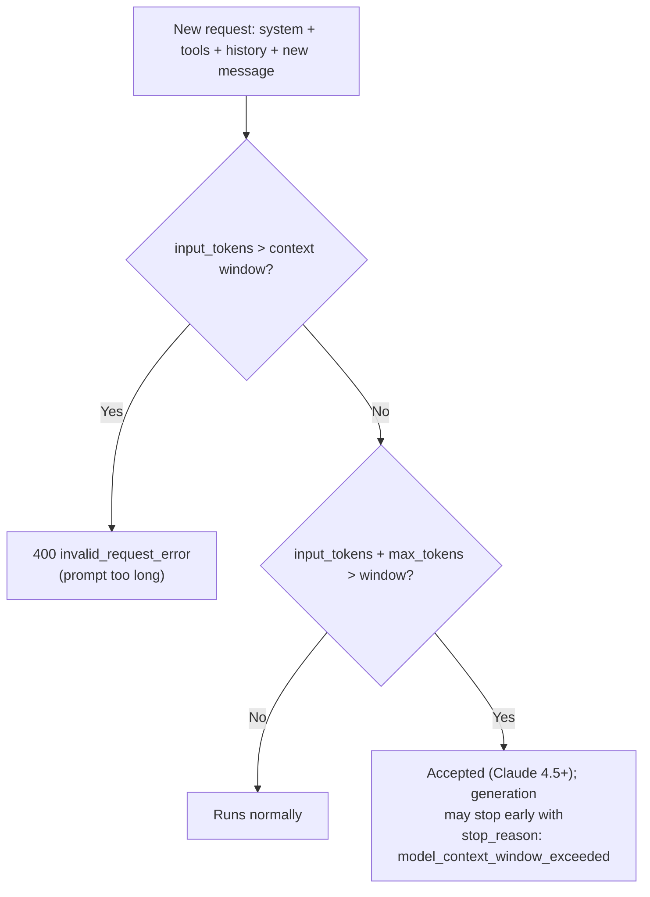
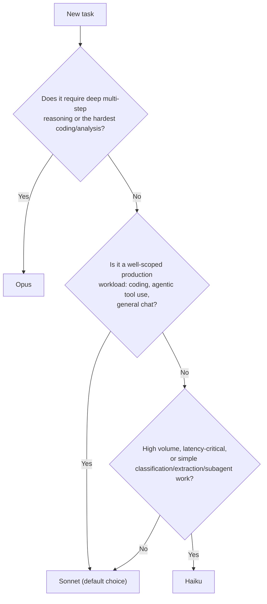

## LLM fundamentals: tokens, tokenization, and why word count lies

- A {{token|The smallest unit of text an LLM processes — roughly a word-piece, not a character or a whole word.}} is the atomic unit a model reads and generates. Claude does **not** see raw characters or whole words — it sees tokens produced by a **tokenizer** that breaks text into sub-word chunks.
- **Rule of thumb (English prose):** ~1 token ≈ **4 characters** ≈ **0.75 words**. This is Anthropic's own published estimate — treat it as a rough conversion, not a guarantee.
- **Token count ≠ word count ≠ character count**, and the gap is *not* constant:
  - Common English words are often a single token; rare words, made-up words, and most non-English text split into **more** tokens per word.
  - Code, JSON, and dense symbol-heavy text tokenize *less* efficiently than prose — punctuation and whitespace both consume tokens.
  - A **newer tokenizer** (introduced with Claude Opus 4.7 and used by Claude Opus 4.7/4.8/5, Sonnet 5, and Fable 5/Mythos 5) produces **~30% more tokens** for the same text compared to the older tokenizer used by Sonnet 4.6 and earlier. Migrating between tokenizer generations silently changes cost and `max_tokens` headroom for identical input.
- **Never estimate Claude token counts with a different vendor's tokenizer** (e.g. `tiktoken` is OpenAI's). It will systematically undercount — sometimes by 15%+ — because tokenizers are model-family-specific.
- To get an *exact* count before sending a request, use the **token counting endpoint** (`POST /v1/messages/count_tokens`), not a guess. This is the only way to reliably budget `max_tokens` or estimate cost ahead of time.
- Everything sent to and returned from the model is priced and budgeted in tokens: the system prompt, every message (including tool results, images, documents), tool *definitions*, and the model's own output (including any thinking tokens) — all counted, all billed.

> **Exam tip:** If a question asks "why did my token count change after switching models," the two most likely answers are (1) a **tokenizer generation change** (not a bug) or (2) you're comparing against a non-Claude tokenizer.

> **Gotcha:** "Shorter in characters" does not mean "cheaper." A short prompt in a verbose tokenizer (or a language that tokenizes poorly) can cost more tokens than a longer, plainer-English prompt.

---

## Context windows: capacity, cost, and context rot

- The **context window** is the model's total "working memory" for one request — every token from `system` + `tools` + `messages` (input) **plus** the tokens the model generates (output) must fit inside it. It is *not* the same thing as the training data the model learned from.
- **Current sizes (verify against the live docs — these shift over time):**
  - Claude Opus 5, Opus 4.8/4.7/4.6, Sonnet 5, and Sonnet 4.6 → **1M-token** context window, and it's the *default* — no special header needed, and it's billed at standard per-token rates (no long-context surcharge).
  - Claude Haiku 4.5 → **200K-token** context window.
  - Claude Fable 5 / Mythos 5 → **1M tokens**, using the newer, ~30%-larger-count tokenizer.
- **"Long context" is not free — it's just not *surcharged*.** You still pay standard per-token price for every token in a 900K-token request; a bigger window means a bigger bill, not a discount. The place caching actually saves money is on *repeated* long context (see the caching section below).
- **Context rot:** as token count grows, model accuracy and recall on the buried-in-the-middle content measurably *degrades* — more available context is not automatically better output. This is why **curating** what's in context matters as much as how much room is available.
- **What happens near/at the limit:**
  - If the **input alone** already exceeds the context window → the API returns a **400 `invalid_request_error`** ("prompt is too long"), on every model.
  - If `input_tokens + max_tokens` together would exceed the window, on Claude 4.5+ models the request is **accepted**, and if generation actually reaches the limit mid-response, it stops with `stop_reason: "model_context_window_exceeded"` (distinct from the ordinary `max_tokens` stop reason). Older models return a validation error instead.
- **Thinking tokens count too.** All thinking output counts toward the context window and is billed as output tokens — see the Extended Thinking section.
- **Cached tokens still occupy the window.** Prompt caching changes what you *pay* for a token, not whether it *counts* toward the window — a common point of confusion.
- **Managing growth:** server-side **compaction** (beta) auto-summarizes older turns once a conversation nears the limit; **context editing** lets you selectively clear stale tool results or thinking blocks. Both exist because "just let the conversation grow" eventually hits the wall above.

> **Exam tip:** A question describing an agent that "gets dumber" or starts ignoring early instructions as a conversation runs long is testing **context rot**, not a bug in the model. The fix is pruning/summarizing context, not raising `max_tokens`.



---

## Sampling parameters: temperature, top-p, and top-k

- LLMs don't pick the "best" next token deterministically — they sample from a **probability distribution** over the vocabulary at every step. Sampling parameters shape that distribution.
- **Temperature ($T$)** controls how "peaky" vs. "flat" the distribution is before sampling. The model's raw output scores (logits, $z_i$) are converted to probabilities via **softmax scaled by temperature**:

$$
P(x_i) = \frac{e^{z_i / T}}{\sum_j e^{z_j / T}}
$$

  - **Low $T$ (→ 0):** the distribution sharpens toward the single highest-scoring token — output becomes deterministic, focused, repeatable. Good for extraction, classification, code, math — tasks with one "right" answer.
  - **High $T$ (→ 1, Claude's ceiling):** the distribution flattens — more low-probability tokens become viable — output is more varied/creative, but also more prone to going off-track. Good for brainstorming, creative writing, generating diverse samples.
  - **$T = 1$** uses the model's raw distribution as-is — this is the Claude default.
- **Top-p (nucleus sampling):** instead of a temperature reshaping, top-p **truncates** the candidate pool to the smallest set of tokens whose cumulative probability reaches $p$ (e.g. `top_p: 0.9` keeps only the tokens covering the top 90% of mass), then samples from that reduced set. This adapts the pool size per step — a very confident prediction keeps the pool small; an uncertain one keeps it larger.
- **Top-k:** a blunter version — restricts sampling to only the $k$ single most-likely next tokens, regardless of their cumulative probability. `top_k: 40` means "only ever consider the 40 most likely tokens."
- **Best practice: adjust temperature *or* top-p, not both.** Anthropic's own guidance is to treat them as alternative knobs on the same underlying idea (distribution shape) rather than stacking them.

> **Gotcha:** `temperature: 0` does **not** guarantee byte-identical, fully deterministic output across repeated calls. It sharply reduces variance but is not a hard determinism guarantee.

> **Exam tip / important current-state note:** on the newest Claude model generations (Opus 4.7 and later, and Claude Sonnet 5), `temperature` / `top_p` / `top_k` are being **phased out as direct request parameters** — sending a non-default value returns a 400 on those models, and Anthropic's recommended replacement for controlling output variety/depth is **prompting** plus the **`effort`** parameter (see below), not manual sampling knobs. Always check current docs for which models still accept these fields — this is exactly the kind of "exact digits change" detail the exam blueprint warns will drift, so know the *concept* (what each parameter does) cold, and treat model-specific availability as a lookup, not a memorized fact.

```python
# Illustrative request body — check current docs for which models accept these fields
{
    "model": "claude-...",
    "max_tokens": 1024,
    "temperature": 0.2,   # low = focused/deterministic-ish
    # "top_p": 0.9,       # don't set both temperature and top_p
    "messages": [{"role": "user", "content": "Extract the invoice total as JSON."}]
}
```

---

## Model tiers: Opus, Sonnet, and Haiku

- Anthropic ships (at minimum) three quality/speed/cost tiers so you can match model capability to task difficulty instead of paying frontier prices for every call. Picking the right tier is one of the highest-leverage cost decisions in an application.
- **Relative ordering (stable across generations, even as exact numbers change):** **Opus > Sonnet > Haiku** on both *capability* and *price*; **Haiku > Sonnet > Opus** on *raw speed/latency*.

| | **Opus** | **Sonnet** | **Haiku** |
|---|---|---|---|
| **Positioning** | Complex agentic coding & enterprise work — highest capability | Best balance of speed *and* intelligence — the production workhorse | Fastest, most cost-effective — near-frontier intelligence for its speed |
| **Relative latency** | Moderate (slowest of the three) | Fast | Fastest |
| **Relative cost** | Highest ($ per MTok) | Mid | Lowest |
| **Context window (recent gens)** | 1M tokens | 1M tokens | 200K tokens |
| **Max output tokens** | 128K | 128K | 64K |
| **Extended/adaptive thinking** | Yes (adaptive) | Yes (adaptive) | No adaptive; some gens support classic extended thinking |
| **Typical use cases** | Deep multi-step reasoning, hardest coding/refactor tasks, high-stakes analysis, coordinator in a multi-agent system | Default choice for most production agentic workloads, coding, tool-heavy pipelines | High-volume classification, simple extraction, subagents/workers, latency-critical chat, cost-sensitive bulk jobs |

> **Note:** Exact context-window sizes, prices, and model IDs shift release to release — the table above captures *today's* rough shape and the *relational* pattern (Opus costliest/slowest/smartest, Haiku cheapest/fastest). Always confirm exact current numbers against the pricing and models-overview pages before quoting a hard figure.

- **Cost formula** for any single request, given input/output token counts and per-million-token prices $p_{in}$, $p_{out}$:

$$
\text{cost} = \frac{\text{input\_tokens}}{10^6}\times p_{in} \;+\; \frac{\text{output\_tokens}}{10^6}\times p_{out}
$$

  Because $p_{in}$ and $p_{out}$ differ by roughly **5×** between Opus and Haiku tiers, tier choice dominates the cost equation far more than prompt-length tweaking does.
- **When to pick which tier — a simple decision heuristic:**



- **Model routing** (a cost-management pattern, not just a tier-picking rule): use a cheap model (Haiku) to *triage* or pre-filter, and escalate only the subset of requests that actually need it to Sonnet/Opus. In multi-agent designs, a common pattern is an Opus/Sonnet **coordinator** delegating narrow, read-heavy sub-tasks to Haiku **workers**.

> **Exam tip:** A question describing "many simple, high-volume, latency-sensitive calls" is almost always pointing at **Haiku** (or a routing pattern that uses Haiku for the bulk of traffic). A question describing "one hard, high-stakes, multi-step task where correctness matters more than cost" is pointing at **Opus**. "Best general default for production agentic/coding work" is **Sonnet**.

---

## Prompt caching: the cost & latency economics

- **Prompt caching** lets you reuse the *processed* form of a stable prefix (system prompt, tool definitions, long documents, few-shot examples) across multiple requests instead of paying full price to reprocess it every time. *(For the exact API mechanics — `cache_control`, breakpoint placement, request syntax — see the Applications & Integration notes; this section is about the cost decision.)*
- **The economics are multipliers on the base input-token price**, not flat fees:

| Cache operation | Price multiplier vs. base input | What it means |
|---|---|---|
| **Cache write, 5-minute TTL** | **1.25×** | You pay a *premium* the first time content is cached |
| **Cache write, 1-hour TTL** | **2×** | Bigger premium, but the entry survives longer |
| **Cache read (hit)** | **0.1×** | A hit costs **10%** of standard input price — the entire value proposition |

- **Break-even math:** because a hit costs 0.1× and a 5-minute write costs 1.25×, caching pays for itself starting at the **second read** for the 5-minute TTL ($1.25\times + 0.1\times < 2\times$ uncached-twice cost), and needs roughly **three total uses** to pay off for the 1-hour TTL ($2\times + 0.2\times$ vs. $3\times$ uncached). Below that reuse count, caching is a net cost, not a savings.
- **Minimum cacheable prefix length is model-dependent** and is *not* monotonic across generations — it ranges roughly from ~512 tokens (newest models) up to ~4096 tokens (some older/Haiku generations). A prefix shorter than the minimum **silently fails to cache** — no error, just `cache_creation_input_tokens: 0` — so a "why isn't my cache hitting" bug is often just "the cached span is too short for this model."
- **Caching is a prefix match.** Any byte-level change anywhere *before* a cache breakpoint invalidates everything after it — a timestamp, a shuffled JSON key, or a reordered tool list at the front of the prompt silently kills the cache for the whole request, even if you never see an error.
- **When it pays off (the decision, not the syntax):**
  - ✅ Long, stable system prompts reused across many requests in a short window.
  - ✅ Multi-turn conversations (each turn reuses the accumulated prior turns).
  - ✅ Agentic loops with large, static tool definitions called repeatedly.
  - ✅ Large reference documents with several follow-up questions against them.
  - ❌ One-off requests — you pay the write premium and never recoup it.
  - ❌ Prompts that change substantially on every call (nothing stable to cache).
- **TTL choice is also a cost decision:** pick the **5-minute** (default) cache when traffic is frequent enough that requests land within 5 minutes of each other; switch to the **1-hour** cache for bursty/sporadic traffic where gaps would otherwise force repeated cold writes — but remember the 1-hour write costs proportionally more, so it needs more total reads to be worth it.
- **Verify it's actually working** via the response's `usage` object: `cache_read_input_tokens` should be **nonzero** on repeat requests. If it's stuck at zero, something in the prefix is changing request-to-request.

> **Exam tip:** If a scenario says "same large system prompt, called dozens of times per minute," the answer the exam wants is **prompt caching with the default (5-minute) TTL**, and the *reason* is the ~10× discount on cache reads — not just "it's faster."

> **Gotcha:** Prompt caching reduces **cost and latency for the cached portion**, but tokens in a cache **still count toward the context window** — caching is not a way to fit more into a fixed window, only a way to pay less for what's already there.

---

## Extended thinking & cost management strategies

### Extended thinking

- **Extended/adaptive thinking** lets Claude generate intermediate reasoning — `thinking` content blocks — *before* producing its final answer, instead of committing to an answer in a single forward pass. It's the model doing visible scratch-work: restating the problem, trying approaches, checking intermediate results, backtracking.
- **Why it helps:** single-pass answers must be right on the first try with no room to "notice and fix" a mistake mid-generation. Thinking gives the model that room — it measurably improves performance on math, complex coding/debugging, multi-step analysis, and long-horizon agentic tasks, where the *quality of intermediate steps* determines the quality of the final answer.
- **It is not free — the cost/latency tradeoff is real:**
  - Thinking tokens are **billed as output tokens**, even on the "summarized" or "omitted" display modes where you don't see the raw reasoning text.
  - Thinking tokens **count toward `max_tokens`** alongside the visible response — a tight `max_tokens` budget on a thinking-enabled request can truncate the *answer*, not just the reasoning.
  - More thinking = more latency, straightforwardly, since it's more tokens the model must generate before you get anything back.
- **Adaptive thinking** (the modern default posture on current models) lets Claude decide *per request* whether and how deeply to think, rather than you hand-tuning a fixed token budget — replacing the older pattern of manually specifying a fixed `budget_tokens` ceiling.
- **The `effort` parameter is the primary lever for the cost/quality tradeoff** on models that support adaptive thinking — it scales *all* generated tokens (thinking, tool calls, and response text), not just thinking:
  - **Lower effort** → fewer/more-consolidated tool calls, less preamble, terser output, cheaper and faster, some capability reduction.
  - **Higher effort** → deeper exploration, more thorough answers, more tool calls, higher cost and latency.
  - Effort levels run roughly `low` → `medium` → `high` (commonly the default) → `xhigh` → `max` (naming and availability vary by model — check current docs).
- **When to reach for it:** enable thinking (or raise effort) for math/logic-heavy problems, non-trivial debugging, long agentic plans, and anything where "get it right the first time" is hard. Skip or minimize it for simple lookups, short classification, and latency-critical chat, where the extra reasoning tokens buy little and cost real money and time.

> **Gotcha:** Changing `effort` (or thinking configuration) **between requests in the same conversation invalidates prompt caching** for that prefix, because it changes the rendered request. If you're relying on a cached system prompt across a long session, pick one effort level and hold it constant for that session.

### Cost management strategies (putting it all together)

- **Right-size the model (routing):** the single biggest lever. Don't default to the most capable/expensive tier for everything — use Haiku for high-volume/simple/subagent work, Sonnet as the general default, and reserve Opus for tasks that actually need its ceiling. See the tier decision tree above.
- **Prompt caching:** for any repeated stable context (system prompts, tool defs, long documents, multi-turn history) — see the dedicated section above. Usually the second-biggest lever after model choice.
- **Batch processing:** for non-latency-sensitive, high-volume workloads (bulk classification, offline summarization), the asynchronous Batch API processes requests at a substantial (roughly **50%**) discount off standard token pricing, in exchange for turnaround measured in hours rather than seconds.
- **Effort / thinking tuning:** don't run every request at maximum reasoning depth — dial `effort` down for routine or well-scoped calls (see above) and reserve deep thinking for tasks that need it.
- **Control prompt and output length:**
  - Trim unnecessary context — don't stuff the whole conversation history or an entire document in when only a slice is relevant (this also fights context rot, see above).
  - Cap `max_tokens` sensibly for the task — an unbounded ceiling on a chat-style task invites unnecessarily long (and costly) responses.
  - Prefer structured outputs / concise-response instructions over verbose free-text answers when a compact format satisfies the requirement.
- **Monitor before you optimize:** the response `usage` object (`input_tokens`, `output_tokens`, `cache_read_input_tokens`, `cache_creation_input_tokens`) is the ground truth for where spend is actually going — optimize the largest real line item, not the one that *feels* biggest.

> **Exam tip:** A scenario combining "high volume," "not time-sensitive," and "same request shape repeated many times" is testing whether you'll reach for **Batch API + prompt caching together** — the two stack, and the question is usually checking that you know both exist and when each applies (batch = latency-insensitive bulk work; caching = repeated *shared prefixes*, latency-sensitive or not).

### Further reading

- [Models overview](https://platform.claude.com/docs/en/about-claude/models/overview) — current model lineup, context windows, and the model comparison table.
- [Context windows](https://platform.claude.com/docs/en/build-with-claude/context-windows) — how the context window is composed, context rot, and overflow behavior.
- [Prompt caching](https://platform.claude.com/docs/en/build-with-claude/prompt-caching) — cache_control syntax, breakpoints, and implementation details.
- [Thinking](https://platform.claude.com/docs/en/build-with-claude/thinking) — extended vs. adaptive thinking, context-window interaction, and per-model support.
- [Effort](https://platform.claude.com/docs/en/build-with-claude/effort) — the effort parameter, levels, and per-model recommended settings.
- [Pricing](https://platform.claude.com/docs/en/about-claude/pricing) — current per-model token pricing, cache multipliers, and batch discounts (verify exact figures here — they change over time).
