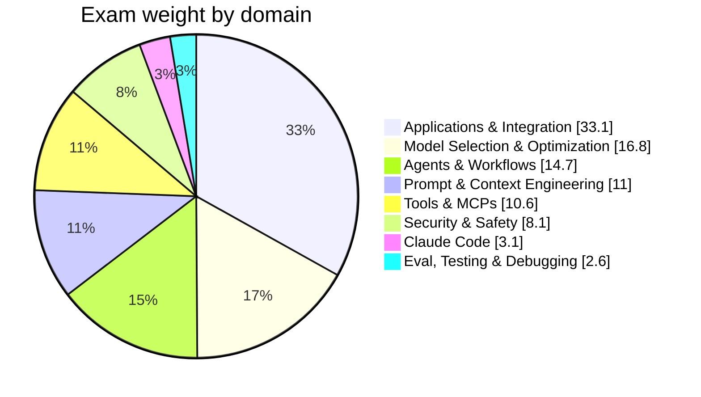

## What CCDV-F actually tests

> **Exam tip:** CCDV-F is a *practitioner* exam, not a trivia exam. Most wrong
> answers are technically-true-sounding but violate a best practice (e.g.
> hardcoding a secret, retrying without backoff, trusting client-side
> correctness). When two options both "work," pick the one that's safest and
> most maintainable.

- **Format:** 53 multiple-choice / multiple-response questions, **120 minutes**.
- **Passing score:** 720 / 1000 (scaled score, not a raw percent — don't try to
  back-solve "how many can I miss").
- **Question types:** `{{single_choice|Exactly one correct option — pick the single best answer.}}` and `{{multiple_response|"Select N" questions — the stem tells you exactly how many choices to pick.}}`. Read the stem for **"select N"** wording before answering.
- **Vendor:** Anthropic. Validates hands-on ability with the Claude API/SDKs,
  agent and workflow design, prompt/context engineering, tool and MCP
  development, security practices, Claude Code, and evaluation/debugging.

## Domain weighting (study time should roughly follow this)

| Domain | Weight | ~Questions on exam |
| --- | --- | --- |
| [Applications & Integration](#applications-integration) | 33.1% | ~18 |
| [Model Selection & Optimization](#model-selection-optimization) | 16.8% | ~9 |
| [Agents & Workflows](#agents-workflows) | 14.7% | ~8 |
| [Prompt & Context Engineering](#prompt-context-engineering) | 11.0% | ~6 |
| [Tools & MCPs](#tools-mcps) | 10.6% | ~6 |
| [Security & Safety](#security-safety) | 8.1% | ~4 |
| [Claude Code](#claude-code) | 3.1% | ~2 |
| [Eval, Testing & Debugging](#eval-testing-debugging) | 2.6% | ~1 |

> **Note:** the top two domains — Applications & Integration and Model
> Selection & Optimization — are just under **half the exam** by themselves.
> If your study time is limited, start there.

## How to use these notes

- Written **bullet-first**: skim the bullets for the "point to ponder," read
  the surrounding prose only when a bullet needs unpacking.
- **Bold** = a term or fact worth memorizing verbatim. *Italics* = a softer
  emphasis or nuance. `code font` = an exact API field, parameter, CLI flag,
  or identifier — the exam frequently tests exact field names.
- Dotted-underline terms (like {{idempotency|Property where making the same
  request multiple times has the same effect as making it once — relevant to
  safe retries.}}) carry a hover/tap definition — use them on mobile too.
- Diagrams are [Mermaid](https://mermaid.js.org/) flowcharts/sequence
  diagrams; equations are rendered with [KaTeX](https://katex.org/).
- Blockquotes are call-outs: **Exam tip** (what the test likes to ask),
  **Gotcha** (common wrong-answer trap), **Note** (background context).
- This is a *supplement*, not a replacement for hands-on practice — pair it
  with the [Practice mode](/practice) filtered by domain, and revisit any
  domain where your practice accuracy is below ~80%.

## Suggested study order

1. Read [Applications & Integration](#applications-integration) and
   [Model Selection & Optimization](#model-selection-optimization) first —
   nearly everything else (agents, tools, prompting) builds on Messages API
   mechanics and model/cost tradeoffs.
2. Then [Prompt & Context Engineering](#prompt-context-engineering) and
   [Tools & MCPs](#tools-mcps) — these are the "how you actually build
   things" domains.
3. Then [Agents & Workflows](#agents-workflows), which composes the above
   into multi-step systems.
4. Finish with [Security & Safety](#security-safety), [Claude
   Code](#claude-code), and [Eval, Testing & Debugging](#eval-testing-debugging)
   — smaller weight, but don't skip them: at ~14% combined they're worth more
   than Claude Code and Eval look individually.
5. Do at least one full-length, timed [Mock Exam](/exam) before the real
   thing to calibrate pacing (120 minutes ÷ 53 questions ≈ **2.3 min/question**,
   but front-load easy ones — flag and skip anything that stalls you past ~3
   minutes).

### Further reading

- [Anthropic API documentation](https://docs.claude.com/) — the primary
  source of truth for every domain below.
- [Anthropic Cookbook](https://github.com/anthropics/anthropic-cookbook) —
  worked code examples referenced throughout these notes.
- [Claude Developer Platform overview](https://www.anthropic.com/api) — product-level orientation.
